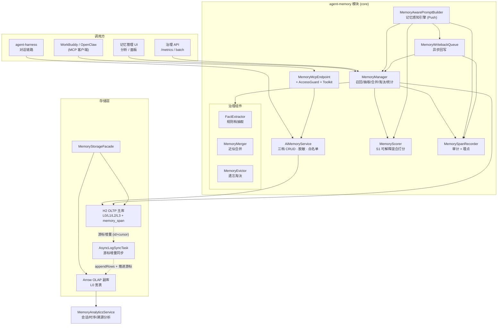
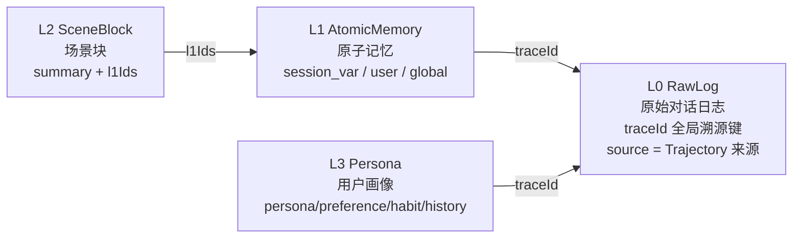
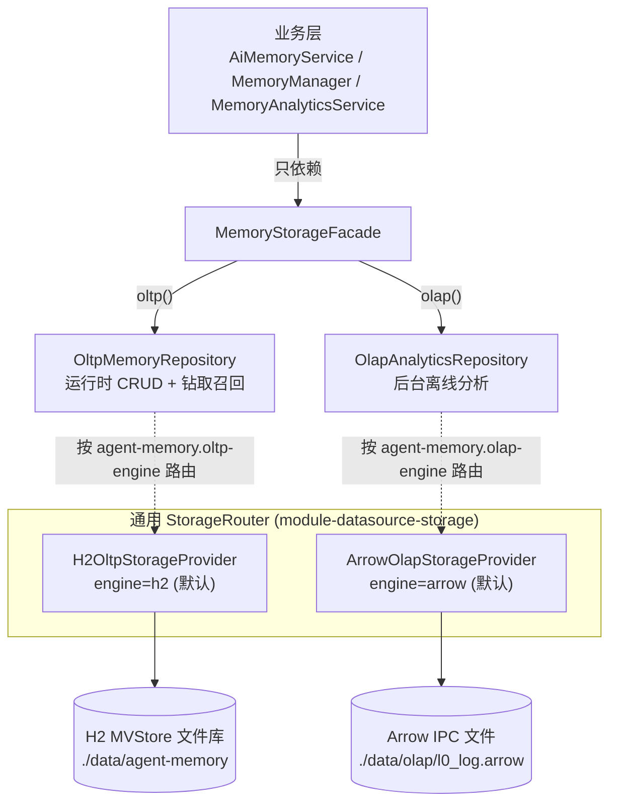
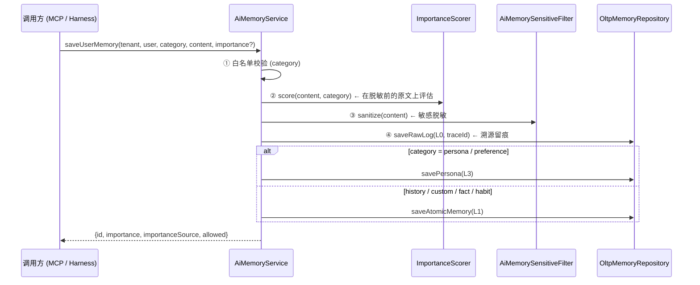
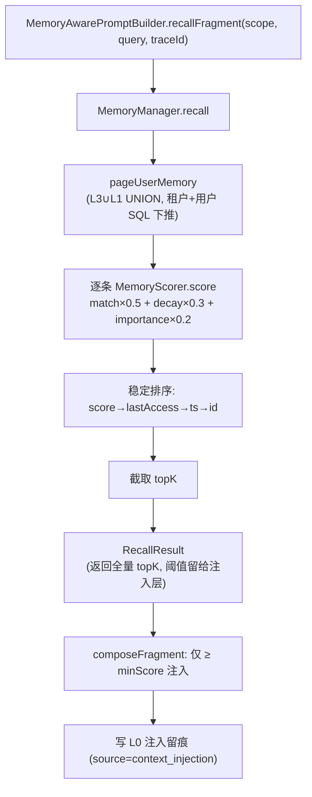
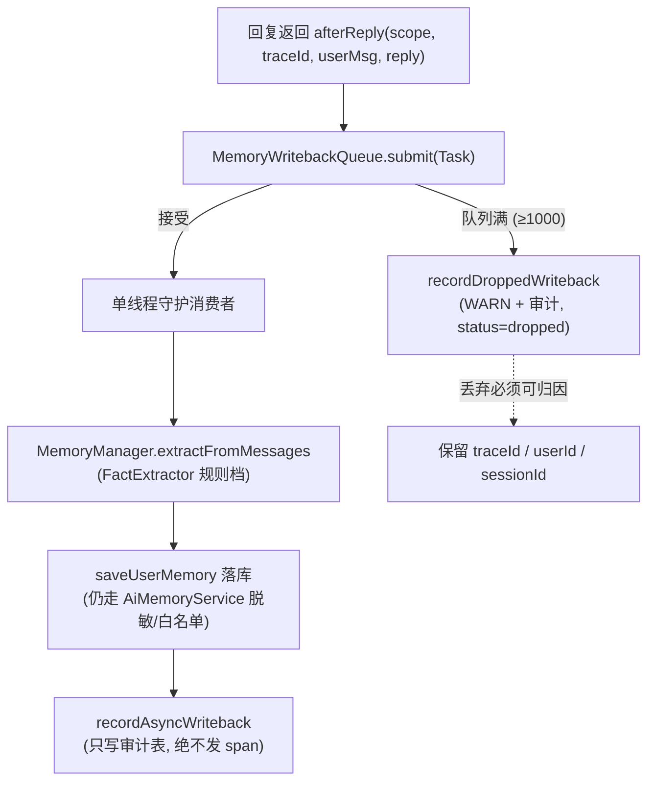
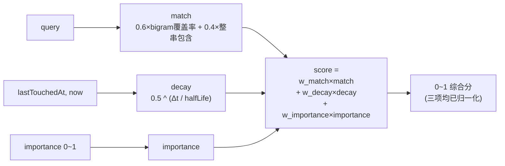
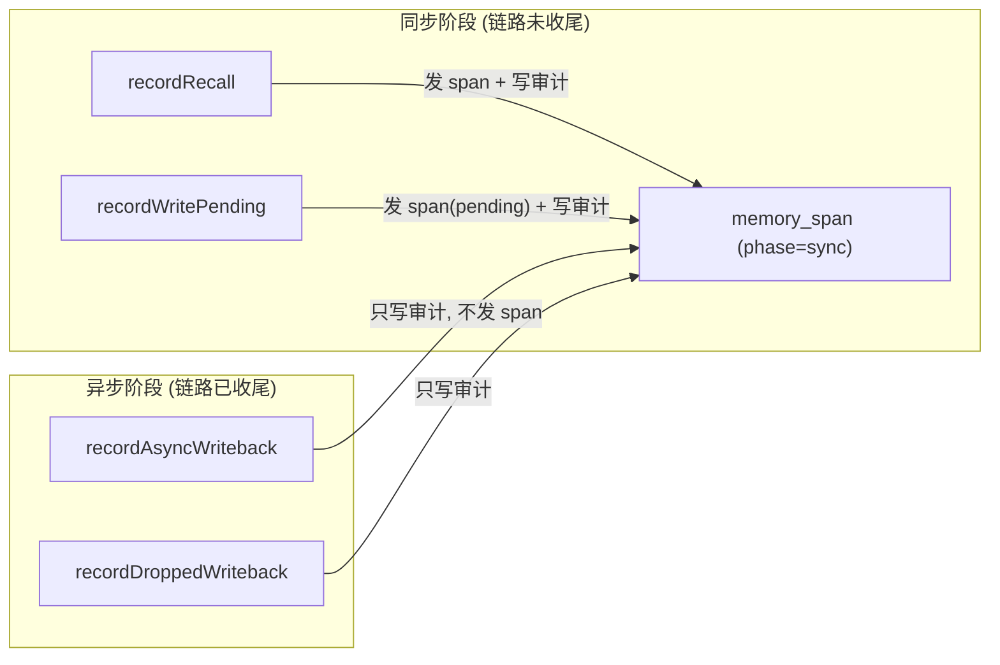
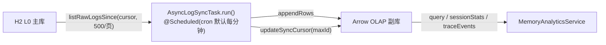
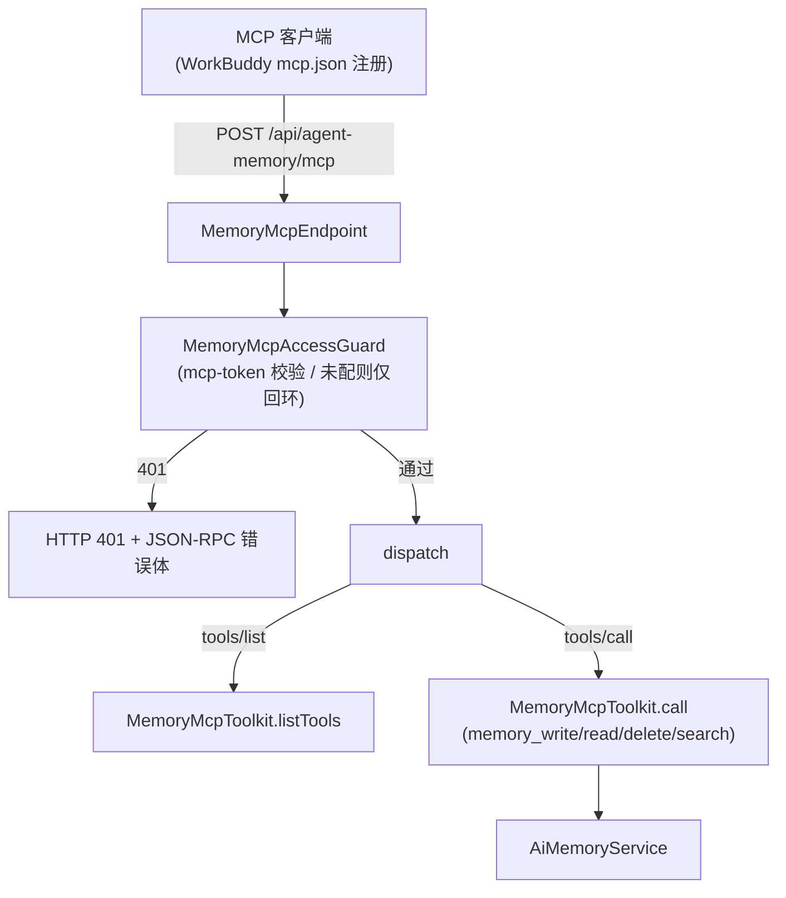

# agent-memory 架构与实现思路

> 日期：2026-09-21
> 定位：对 `modules/agent-memory/` 的代码级架构梳理与实现思路总结。
> 配套文档：`docs/agent-memory-backend-code-description.md`（逐类说明）、`docs/plans/2026-09-15-agent-memory-module-prd.md`（规格）。本文聚焦**架构图 + 设计取舍**，不重复逐类罗列。

---

## 0. 一句话定位

一个**四层金字塔记忆系统**：H2 MVStore（OLTP）承载运行时记忆 CRUD 与召回，Arrow/Calcite（OLAP）承载后台分析；对外通过 **MCP（HTTP JSON-RPC）** 与 AI 对话链路深度集成；内建**记忆感知引擎**（推理前 Push 召回注入 + 回复后异步抽取回写）、**S1 可解释混合打分**、以及**合并/遗忘淘汰/抽取**治理闭环。

> 代码规模：core 51 类 / ~4500 行 + 独立 application 1 类。详见后端代码描述文档。

---

## 1. 整体架构图

**读图要点**
- 运行时读写只走 `OltpMemoryRepository`（H2）；OLAP 副库只被后台分析与 ETL 触碰 → **读写负载严格分离**。
- 所有落库都经过 `AiMemoryService` 这一**唯一写入出口**，脱敏、白名单、重要性评估只有一处实现（多一条写入路径就多一处漏点）。
- `MemoryManager` 是治理门面：CRUD 委派给 `AiMemoryService`，召回/抽取/合并/淘汰/统计在本层编排。

---

## 2. 四层记忆模型（数据模型）

| 层 | 类 | 语义 | 召回/淘汰 |
|---|---|---|---|
| L0 | `L0RawLog` | 原始日志，可溯源、可回放；`id` 自增主键供 ETL 游标 | 不入召回，只做留痕与溯源 |
| L1 | `L1AtomicMemory` | 不可再分的原子记忆；类型 `session_var/user(global)` | 参与召回打分与遗忘淘汰 |
| L2 | `L2SceneBlock` | 按会话聚合的上下文块，含 `summary` 摘要 + 关联 `l1Ids` | 会话启动优先加载做骨架 |
| L3 | `L3Persona` | 跨会话稳定画像；`version` 演进；叠加 Caffeine 进程缓存 | 参与召回；高重要性来源 |

**类型语义重载（易踩坑点）**：L1 的 `global` 类型，`user_id` 列**实际存放 tenantId**；`session_var` 与 `global` 的 `user_id` 语义与正常用户记忆不同。因此「按 userId 取全部」时必须显式排除这两类，否则会把租户级/会话级数据混入用户记忆。

---

## 3. 双存储引擎：SPI 插拔 + 读写分离

- **SPI 已通用化**：`StorageContext / StorageProvider<T> / StorageRouter` 来自 `com.zimo.module.ds.storage`，可被任意模块复用。
- **零 JNI**：OLAP 用 Arrow + Calcite 纯 Java 实现，非 DuckDB/JNI。
- **插拔性**：换 MySQL/DuckDB 只需实现 Provider 接口 + 注册 Bean + 改 `agent-memory.oltp-engine/olap-engine`，业务零改动。
- **H2 豁免**：本模块是全仓库唯一被批准使用嵌入式 H2 的位置（2026-08-18 用户明确批准），其他模块一律 MySQL。

---

## 4. 写入主链路（三档 CRUD）

**关键次序（不能颠倒）**：重要性评估必须在**脱敏前的原文**上做。若先脱敏再打分，`138****8000` 已不匹配手机号规则，敏感降权会静默失效。

**返回体诚实性**：返回 `importanceSource = scored | explicit` 与 `importanceSignals`。显式指定重要性时不回显自动信号——否则调用方会误以为存进去的分值是「系统算出来的」，掩盖「我的入参是否生效」。

---

## 5. 记忆感知引擎：Push 召回 + 异步回写

这是模块从「被动记忆库」变成「主动记忆」的核心。与 `memory_read/search` 的 **Pull**（模型自主决定读）不同，这里是 **Push**（推理前主动注入）。

### 5.1 召回流水线

- **阈值在注入层判断，不在召回层丢**：召回返回全部 topK + 标记 `injectedCount`，过滤在 `composeFragment` 做。否则低分条目被提前丢弃，阈值问题无法调试。
- **空召回不注入任何内容**：连标题都不加。注入「暂无记忆」占位文本会污染上下文、破坏 Prompt 缓存命中。
- **冲突声明是硬约束**：片段首行必须是「仅供参考，若与用户当前陈述冲突，以用户当前陈述为准」。否则用户改了偏好仍被反复按旧偏好处理且无法理解为何改不掉。
- **入系统提示词，不插 messages**：早期版本自己构造 SYSTEM 消息插进 messages，被 AgentScope 拒绝（`Hooks must not inject SYSTEM messages into PreCallEvent.inputMessages`），表现为每条命中记忆的对话都失败。

### 5.2 异步回写队列

- **带消息体而非只带 traceId**：会话侧 L0 用的是 `convo-` 前缀自生成 traceId，与链路 traceId 不是同一值。若异步侧按链路 traceId 回查 L0 会一条都查不到 → 「回写静默空转」。因此任务自带本轮消息（内存构造，**不重复落 L0**）。
- **背压取舍**：队列满时**拒绝新任务**而非挤掉最老的（老任务已等很久，丢弃它等于白付等待成本）。丢弃必须留痕。
- **单消费者守护线程**：处理顺序=入队顺序，便于排查；抽取是低延迟规则档，单线程足以支撑（LLM 档默认关）。

---

## 6. S1 可解释混合打分器

- **默认权重** `match 0.5 / decay 0.3 / importance 0.2`；半衰期 30 天；topK 8；注入阈值 0.25。
- **`match` 而非 `similarity`**：用字符级 2-gram 覆盖率，不是语义相似度。中文无空格分词，单字命中会被「的/了/是」高频虚词主导；bigram 对虚词贡献天然更小，且零依赖、可离线回归。**命名诚实是这套方案能被信任的前提**。
- **纯函数 + 可回归**：`MemoryScorer` 不持可变状态、不做 IO、不读时钟（`now` 由调用方传入）。同一输入必然逐位相同 —— 这是「分数可回归」验收标准成立的基础。
- **Δt 量化到整小时**：否则 `now` 的毫秒抖动会让同一条目两次召回分数在第 10 位小数漂移，使「连续 3 次逐位相同」永不成立。量化代价可忽略（半衰期 30 天，一小时衰减误差 ≈ 0.096%）。
- **权重和在启动期校验**：和 ≠ 1 直接抛 `IllegalStateException` 终止启动。配置错必须在启动期暴露，不允许「服务起来了但分数恒为 0」。
- **单实例口径**：`recall / merge / evict` 共用**同一个 `MemoryScorer` 实例**，保证「低分不注入」与「低分淘汰」是同一套标准。

---

## 7. 治理闭环

`MemoryManager` 在 CRUD 之上编排五类动作：

| 动作 | 组件 | 说明 |
|---|---|---|
| 召回 | `MemoryScorer` | 见 §6 |
| 抽取 | `FactExtractor` | 规则档默认开，LLM 档默认关（决策 D2）；落库仍走 `AiMemoryService` |
| 合并 | `MemoryMerger` | 复用 `MemoryScorer.match` 做近似判定，同用户+同类别+内容近似归并 |
| 淘汰 | `MemoryEvictor` | 复用同一 `MemoryScorer`；低分且超期条目淘汰，带安全阀 `SAFETY_RATIO` |
| 统计 | `MemoryMetrics` / `AccessCounter` | 进程内计数，由定时调度批量落库（计数更新不阻塞查询） |

**事务边界**：本类**不做**事务编排。召回是纯读；抽取/合并/淘汰逐条处理且允许部分成功（PRD §6.2「部分失败不回滚」）。套事务只会把已成功条目一起撤销，放大数据损失面。

---

## 8. 可观测与审计：`memory_span`

- **同步/异步相位分工（硬约束）**：异步阶段（链路已收尾，`GenAiTraceObserver` 已 `remove` 容器）**绝不发链路 span**——再发会「不导出 + 不释放」，且被 `catch` 静默。因此异步结果只落 `memory_span` 审计表，靠 `phase=sync/async` + `traceId` 对齐。
- **审计 append-only**：`memory_span` 不提供 update/delete。审计可被改写就不再是审计；「异步是否完成」由是否存在对应的 `async` 记录表达。
- **唯一写入点**：`MemorySpanRecorder` 是模块里唯一写审计表与发 `memory.*` span 的地方，避免多路径属性名错写/漏传。
- **留存副本**：进程内保留最近 200 条链路的 span 副本（按访问序淘汰），供面板按 traceId 反查「这次对话用了哪些记忆」。

---

## 9. ETL 同步（OLTP → OLAP）

- **游标增量**：游标 = 已同步 H2 L0 最大自增 id，持久化于 OLAP 文件旁的 `.cursor`。每次只拉 `id > cursor` 的日志追加，完成后推进游标；重启从游标继续，不重复。
- **首轮/游标未知 → 全量重建**：按 `traceId+ts+role` 去重后整体替换，避免与既有数据重复。
- **异常不抛出**：任务自愈，失败只 WARN，不影响主对话链路。

---

## 10. MCP 接入层

- **协议**：HTTP JSON-RPC 2.0，`initialize / tools/list / tools/call`。
- **工具**：`memory_write`（session/user/global）、`memory_read`、`memory_delete`、`memory_search`。
- **准入**：被 `plugin.auth` 排除白名单，鉴权在 POST 入口由 `AccessGuard` 完成。配了 `agent-memory.mcp-token` 校验 `Authorization`；未配则仅放行回环来源（建议经 `AGENT_MEMORY_TOKEN` 环境变量注入）。
- **租户透传**：`search` 曾把租户写死 `default`，与同进程 `read/write` 按真实租户行为不一致 → 已修复为透传调用方 `tenantId`。

---

## 11. 安全：白名单 + 敏感脱敏

- `MemorySecurityConfig`：`whitelistCategories`（空=放行全部）+ `sensitiveFiltering` 开关。
- `AiMemorySensitiveFilter`：手机号/身份证等敏感内容掩码；写入前脱敏。
- **脱敏与降权同一实例**：`ImportanceScorer` 与 `AiMemorySensitiveFilter` 共用同一 `AiMemorySensitiveFilter` 实例，保证「已脱敏」与「敏感降权」口径一致（避免「已脱敏但没降权」）。
- **保护机制**：`importance ≥ 0.9`（或显式标记）记忆**免于遗忘淘汰**。`MemoryMcpToolkit` 的 `inputSchema` 必须显式写明这一点，否则模型永远不会传，保护机制等于不存在。

---

## 12. 实现思路（核心设计取舍）

以下是从代码反推出的**真正起作用的设计原则**，也是本模块区别于「又一个记忆库」的地方：

1. **隔离维度强制成编译期约束**：`tenantId + userId/userId` 在所有涉及用户/会话的仓储方法里都是必填参数，接口刻意不提供「只有 userId」的重载。历史上因缺租户维度导致跨租户串数据（缺陷 D8b），把租户做成必填让漏传在编译期暴露。

2. **单一写入出口**：所有落库走 `AiMemoryService`。脱敏、白名单、重要性评估只在这一处实现。门面/批量/回写/MCP 全部委派给它——多一条写入路径就多一处脱敏漏点。

3. **记忆是增强能力，失败不反噬**：召回失败、L0 留痕失败、队列满，全部 `try/catch` + `WARN`，**绝不阻断对话**。静默吞异常是本项目反复踩过的坑，因此这里禁止「吞掉且不留痕」。

4. **阈值校验在启动期**：权重和 ≠ 1、半衰期 ≤ 0、topK ≤ 0、minScore 越界 → 直接终止启动（Spring `IllegalStateException`）。配置错必须在使用前暴露，不接受「悄悄换成默认值」。

5. **纯函数保证可回归**：`MemoryScorer` 不持状态、不读时钟，`now` 由调用方传入，Δt 量化到整小时。否则「分数可回归」验收标准永不成立。

6. **同步/异步相位分工**：异步阶段（链路已收尾）绝不发链路 span，只写 append-only 审计表。用「延迟 N 秒再导出」是被否决的方案——N 无法覆盖所有异步任务，只会把「丢 span」变偶发。

7. **审计 append-only**：`memory_span` 不提供 update/delete。「异步是否完成」由是否存在对应 `async` 记录表达，而非改写 sync 记录状态。

8. **打分口径单一**：召回、合并近似判定、淘汰阈值共用同一个 `MemoryScorer` 实例，杜绝「低分不注入却长期留存」与「低分被淘汰」两套互不相容标准。

9. **注入层的三条铁律**：① 必声明「以用户当前陈述为准」（否则改不掉偏好）；② 空召回不注入任何内容（避免污染上下文、破坏缓存）；③ 注入内容必须进 L0（否则「模型当时看到什么」不可追溯）。

10. **写读两侧必须同源**：会话记忆写入的 `sessionId`/`tenantId` 与读取端必须完全一致（如 chat 端 `pi-` 前缀、`u001` 租户）。两侧任一侧漂移都会造成「面板永久空」却无任何报错。

11. **删除返回真实影响行数**：所有删除方法返回 `int` 而非 `void`，且按 id 删除时 L3 与 L1 两表都尝试（列表接口两表合并返回）。历史上只删 L1、拿到画像 id 时一行都删不掉却报成功（缺陷 D12/D13）。

12. **计数更新不阻塞查询**：召回访问计数在请求线程只做进程内累加（`AccessCounter`），由定时调度固定间隔（默认 30s，`fixedDelay`）批量落库，而非每次查询都写库。

---

## 13. 部署与集成

- **独立应用**：`AgentMemoryApplication` 仅装配四层记忆能力，不加载 sys/auth/ai/feishu 等业务模块，**无需 MySQL**（H2 豁免）。启动类包名 `com.zimo.agentmemory.app` 刻意避开 core 包，避免组件扫描与 `@Bean` 重复装配。
- **与 agent-harness 解耦**：两模块无编译依赖，通过 **MCP（HTTP JSON-RPC）** 集成——harness 端用 `MemoryMcpClient` 调 `memory_write/read`，把每轮对话真实写入记忆（见历史任务「每个聊天会话都要调用 agent-memory 的 mcp 记录起来」）。
- **端点汇总**：
  - `POST /api/agent-memory/mcp` — MCP 接入（WorkBuddy 注册）
  - `/api/ai/memory` — 兼容记忆接口（AiMemoryController + MemoryGovernanceController）
  - `/api/agent-memory/analytics` — OLAP 分析
  - `/api/agent-memory/file/**` — 文件兼容模式（`{baseDir}/{agentId}/MEMORY.md`，OpenClaw 互通）
  - `/api/agent-memory/memory-arch` — 分层架构配置（USER/SOUL）

---

## 14. 一句话总结实现思路

> **把「记忆」当成一个带强制隔离、可解释打分、失败不反噬、可溯源可审计、读写分离的独立子系统来建**——核心不是「存得下」，而是「召回得准、治理得动、出错不崩、出了错能查」。所有看似啰嗦的约束（启动期校验、append-only 审计、双维度必填、单实例打分、写读同源）都是在为「记忆系统长期不腐坏」付的架构债利息。
