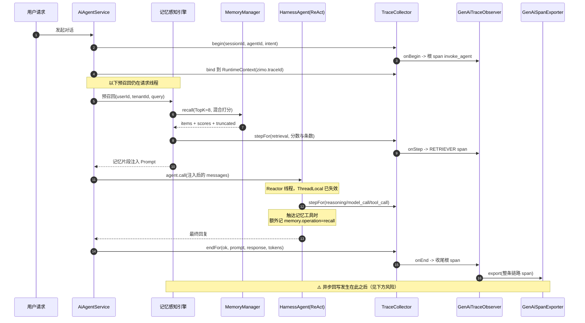
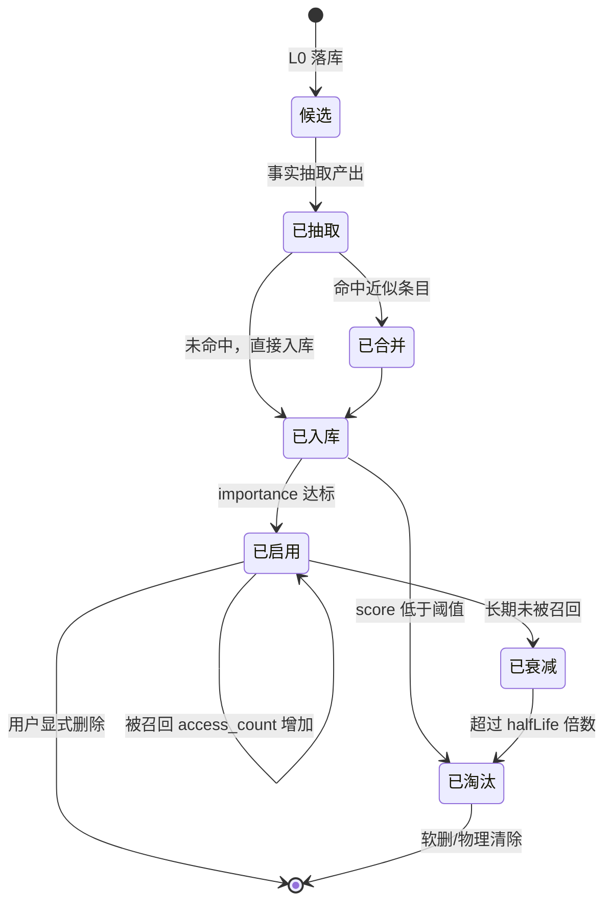
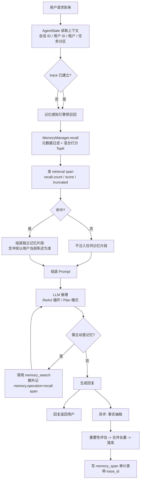
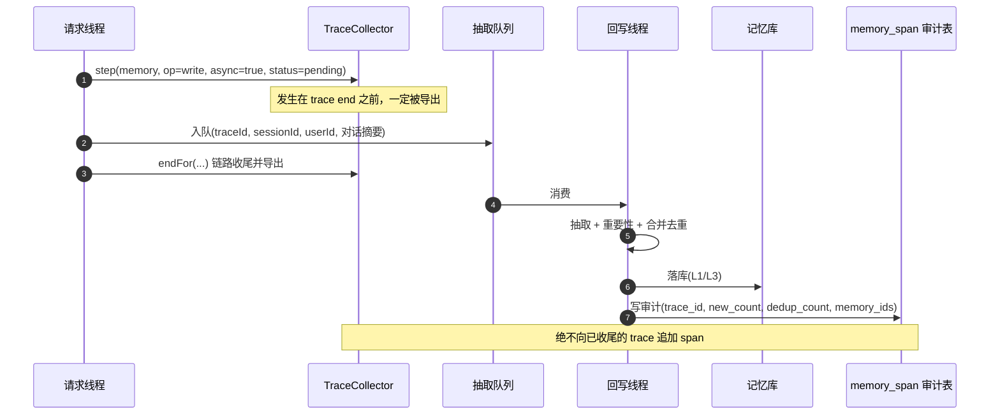
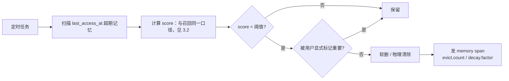

# 智能体记忆模块 产品需求文档（PRD）

| 项 | 内容 |
| --- | --- |
| 状态 | **已确认**（2026-09-15 评审通过；4 项决策已拍定，见 §十五） |
| 起草日 | 2026-09-15 |
| 决策日 | 2026-09-15（决策记录见 §十五） |
| 关联模块 | `modules/agent-memory`（记忆主体）、`modules/agent-trace`（链路追踪）、`framework/framework-ai`（Agent 装配与观测桥接）、`frontend/agent-harness-ui`（可观测面板） |
| 依赖前置文档 | `docs/agent-memory-backend-code-description.md`（代码现状与 D1–D21 缺陷清单） |
| 结构说明 | 本文按 PRD 组织（模块说明 / 数据模型 / 接口 / 流程 / 埋点 / 风险）。文末补 `十一～十三` 节以符合 `docs/rules/PLAN_DOC_RULES.md` 对「真机可判定成功标准」与「延后项」的硬性要求 |

> **一句话**：让智能体具备跨会话长期记忆，并把每一次记忆读写变成链路里可看见的 span。

---

## 一、业务目标与范围

### 1.1 业务目标

1. **跨会话长期记忆**：智能体记住用户偏好、历史交互事实、业务经验，下次会话无需重新告知。
2. **记忆全链路可观测**：写入 / 召回 / 更新 / 删除 / 抽取 / 淘汰每个动作都产出 span，进入既有 Session-Trace-Span 体系，在可观测面板按链路查看「这条记忆是什么时候、因为哪次推理被写入或被召回」。
3. **与 Agent 执行框架原生打通**：记忆不是外挂的旁路服务，而是 ReAct 推理循环、Plan-and-Execute 计划模式、AgentState 状态机的一等参与者。

### 1.2 本期范围

| 范围内 | 范围外（见 §十三） |
| --- | --- |
| 三层记忆分类（工作 / 短期 / 长期）与既有 L0–L3 四层模型的语义对齐 | **语义向量召回 S2**（已决策：本期只做 S1 可解释混合打分，见 §3.2 与 §十五 D1） |
| MemoryManager 的增删改查 + 事实抽取 + 重要性评估 + 记忆合并 + 时间衰减 + 遗忘淘汰 | 跨租户记忆共享与联邦检索 |
| 记忆感知引擎（召回 → Prompt 组装 → 异步回写） | 训练/微调类个性化 |
| 记忆埋点接入 Trace（含异步 span 生命周期方案） | 记忆向量库的外部选型落地（Milvus/Qdrant 等） |
| 租户与用户双维隔离补齐（含表结构变更） | 前端可观测面板的记忆专用视图（仅约定接口与字段） |

---

## 二、记忆分类与模型映射

用户视角的**三层记忆**与代码既有的**四层金字塔（L0–L3）**不是替代关系，而是抽象层级不同的两套说法。下面这张表是本 PRD 的术语基准，后续章节一律沿用。

| 业务分类 | 定义 | 生命周期 | 对应既有实现 | 现状 |
| --- | --- | --- | --- | --- |
| **工作记忆** Working | 任务内临时中间数据（当前目标、已试过的方案、临时变量） | 一次 run / 一次 reply，**不持久化进长期记忆库** | 无专用承载 | **缺** |
| **短期记忆** Short-term | 单会话对话历史，受 LLM 上下文窗口限制 | 单会话 | `AiConversationMemory`（会话消息 + 压缩协议）+ Harness `compaction` | 已有 |
| **长期记忆** Long-term · 情景 Episodic | 具体交互事件（谁在何时说了什么、发生了什么） | 持久化 | `L0RawLog`（原始事件流）+ `L2SceneBlock`（会话场景块） | 已有 |
| **长期记忆** Long-term · 语义 Semantic | 抽象事实、用户偏好 | 持久化 | `L3Persona`（persona/preference）+ `L1AtomicMemory`（fact/preference） | 已有 |
| **长期记忆** Long-term · 程序性 Procedural | 流程、工具调用经验（"这类任务通常先查 A 再改 B"） | 持久化 | 无专用承载（`L1` 的 `custom`/`task` 是借位） | **缺** |

**两条本期必须补齐的空缺**：工作记忆、程序性记忆。后者是 Plan-and-Execute 模式能否用上记忆的关键输入（见 §4.2）。

---

## 三、模块说明

### 3.1 MemoryManager（记忆管理器）

**职责**：记忆写入门面 + 六项治理能力（抽取 / 重要性 / 合并 / 衰减 / 淘汰 / 统计）。

| 能力 | 现状 | 本期设计 |
| --- | --- | --- |
| 增删改查 | `AiMemoryService` 已有（session/user/global 三档） | 保留并向后兼容，在其上抽 `MemoryManager` 门面 |
| 事实抽取 | **无**（`memoryarch/extract` 是档案卡提取，语义不同，不复用） | `FactExtractor`：从 L0 对话轮次抽事实候选，规则+LLM 双档（见下） |
| 重要性评估 | **无** | `ImportanceScorer`：0~1 分，见 §5.2 |
| 记忆合并 | **无** | `MemoryMerger`：同 user + 同 type 的近似条目归并，保留高 importance、累加 access_count |
| 时间衰减 | **无** | 见 §3.2 打分公式：`decay = 0.5^(Δt / halfLife)`，halfLife 默认 30 天 |
| 遗忘淘汰 | **无** | 定时任务按 `score < 阈值`（**与召回同一口径**）且 `last_access_at` 超期淘汰（软删优先） |
| 统计监控 | 仅 OLAP 有会话级统计 | `MemoryMetrics`：总量、分层分布、召回命中率、平均召回分 |

**关键设计决策**：

1. **门面而非重写**。`MemoryManager` 是对 `AiMemoryService` + 仓储的编排层，不推翻既有三档语义（session/user/global），避免 D1–D21 之外再引入回归面。
2. **抽取双档**：
   - *规则档*（默认开、零成本）：模式识别 —— 用户显式陈述偏好的句式、身份信息、明确指令（"以后都用 X"）、任务结论。
   - *LLM 档*（**已决策：默认关**，见 §十五 D2）：把一轮对话交给模型产出 `{content, type, importance}` 三元组。理由是 **LLM 抽取必然引入额外模型调用与延迟**，必须可关；且抽取在异步侧执行，失败可丢弃，不能影响回复。配置项 `agent-memory.extract.llm-enabled` 默认 `false`，仅在压测/回填时显式打开。
3. **抽取异步、召回同步**。写入路径同步只做「L0 落库 + 入队」，抽取与归并在异步线程完成。同步路径延迟不得因记忆能力增加（见 §9.2）。
4. **所有跨度上限必须可见**。既有 D10（先截断再分页，500 条以上静默丢数据）、D9（不传 category 丢全部 L1）属于「静默错误」，本期召回/列表接口一律返回 `truncated` 与 `total` 信号（见 §6）。

### 3.2 向量存储底座

**职责**：为召回提供相似度能力与元数据过滤。

**现状（必须正视）**：

| 事实 | 证据 |
| --- | --- |
| `embedding` 列从未被真实路径写入 | `AiMemoryService` 三处 `new L1AtomicMemory(...)` 第 7 参恒传 `null` |
| 无向量检索方法 | `OltpMemoryRepository` 只有 `recallAtomicByType/BySession`，均 `ORDER BY ts DESC` |
| `PureJavaVectorUtil` 零调用方，且**不是嵌入模型** | `featureVector()` 是字符哈希袋（`bucket = ch * 31 % dims`），中文下余弦相似度只反映字形/共用字符比例 |

即：**当前所谓"记忆召回"实际是时间倒序，没有任何语义相似度**；`memory_search` 是子串匹配。

**本期方案：S1 可解释混合打分（已决策，见 §十五 D1）**

不引入嵌入模型、不引入向量库。召回 = 元数据过滤 + 可解释加权打分 + Top-K。

**打分公式**（三项均已归一化到 0~1，故加权和天然落在 0~1）：

```text
score = 0.5 × match + 0.3 × decay + 0.2 × importance

match      = 0.6 × bigramOverlap(query, content) + 0.4 × (content 包含 query ? 1 : 0)
decay      = 0.5 ^ (Δt / halfLife)     Δt = floor((now - last_access_at) / 1h) × 1h
                                       缺省取 created_at；Δt 量化到整小时（见下）
                                       halfLife 默认 30 天，可配
importance = 条目自身 importance（0~1）
```

> **Δt 必须量化到整小时（2026-09-15 实测修正）**：原公式里的 `Δt` 用毫秒，而 `now`
> 每次调用都不同 —— 同一条目两次召回的分数会在第 10 位小数漂移（实测
> `0.6399999996790985` vs `0.6399999994384225`），使下方「排序稳定性」要保证的
> **§十一 标准 14「连续 3 次调用 score 逐位相同」永远无法通过**。漂移来自时钟而非随机数，
> 放宽断言只会把问题藏起来。量化代价：半衰期 30 天下一小时带来的衰减误差
> `1 - 0.5^(1/720) ≈ 0.096%`；收益：分数在同一小时内逐位可复现，召回质量才可被对比。
> **已按此修正落地并在真机取证**：三次召回 score 逐字符一致（见 §十六 验证结果 ②）。

| 参数 | 默认值 | 配置项 | 说明 |
| --- | --- | --- | --- |
| 权重 | 0.5 / 0.3 / 0.2 | `agent-memory.recall.weights` | **三者之和必须 = 1，否则启动失败** |
| `halfLife` | 30 天 | `agent-memory.recall.half-life-days` | 衰减半衰期 |
| `topK` | 8 | `agent-memory.recall.top-k` | **必须真正生效**（现状 `rankScores` 忽略 topK 且不排序） |
| 注入阈值 | 0.25 | `agent-memory.recall.min-score` | 低于此分**不注入** Prompt，对应风险 R3 |

**为什么 `match` 用字符级 bigram 而非单字命中**：中文无空格分词，单字命中会被"的 / 了 / 是"这类高频虚词主导（几乎任何句子都能与任意记忆"命中"）。bigram 对虚词的贡献天然更小，且零依赖、可离线回归。**它不是语义相似度，因此字段名就叫 `match`，不叫 `similarity`** —— 命名诚实是这套方案能被信任的前提。

**为什么权重和必须 = 1 且在启动期校验**：与 D7 掩码组引用校验同一原则 —— 配置错误要在启动时暴露，而不是等用户查记忆时才发现分数恒为 0。一致性 `IllegalStateException` + 明确文案。

**排序稳定性（分数可回归的前提）**：
`score DESC` → `last_access_at DESC`（null 视为 0）→ `ts DESC` → `memory_id ASC`。
末位用 `memory_id` 兜底，保证同分条目跨查询顺序**完全确定**，否则 §十一 的分数回归会偶发失败。

**计数更新不阻塞查询**：召回命中后需 `access_count + 1` / `last_access_at = now`，但**不在查询路径同步写库**（否则每次召回都写放大，直接违背 §9.2 的 P95 ≤ 50ms）。做法：进程内累加器 + 定时 flush（默认 30s）或队列批量落库；崩溃丢失少量计数可接受 —— 它只服务于衰减参考，不是账本。

**元数据过滤全部下推 SQL**：`tenant_id` + `user_id` + `memory_type ∈ types` + 可选时间窗，不依赖内存过滤。这是 D9/D10 修复后的必要条件。

> **S2（语义向量召回）已决策延后**（§十三）。将来上线 S2 时保留 S1 作降级路径，并**新增埋点属性 `memory.recall.algorithm`**（`s1_hybrid` / `s2_vector`）—— 没有这个字段就无法验证 S2 是否真的更好，A/B 也做不成。

### 3.3 记忆感知引擎

**职责**：在 Agent 推理循环中完成「召回 → Prompt 组装 → 事实抽取回写」。

**现状**：不存在。当前只有 `AiMemoryAgentTool`（`memory_write` / `memory_read`）—— 即**让模型自己决定去读记忆（pull）**。这是两件不同的事：

| 模式 | 机制 | 问题 |
| --- | --- | --- |
| Pull（现状） | 把记忆工具注册进 Toolkit，模型自主调用 | 依赖模型主动性；召回时机不可控；无法保证 Prompt 里有用户偏好；埋点只能看到 `tool_call`，分不清"查记忆"与其他工具 |
| **Push（本期新增）** | 引擎在推理前主动召回并注入 Prompt | 时机确定、可埋点、可测量 |

**设计**：预召回在 `AiAgentService` 内、`TraceCollector.begin()` **之后**、调用 agent **之前**执行一次。放在这个位置的理由：traceId 此刻才产生（**没有 traceId 就无法给召回埋点**），且注入必须在 messages 交给 agent 之前完成。

> ⚠️ **行数约束（实现前必读）**：`AiAgentService` 有效行 **469 / 上限 500**，**净增只能 ≤ 31 行**（`docs/rules/CODE_SIZE_RULES.md`）。因此预召回逻辑**不得内联**在服务里，必须落在独立类（`MemoryAwarePromptBuilder`：召回 + 组装片段 + 改写 messages），服务层只加一行调用。

引擎内部步骤：

1. 从 `RuntimeContext` 取 `sessionId` / `userId` / `tenantId`；
2. 调 `MemoryManager.recall(...)` 拿 Top-K（默认 K=8）；
3. 组装**独立片段**（不是塞进 system prompt 的一句话）：
   ```text
   ## 已知的用户长期记忆（仅供参考，若与用户当前陈述冲突，以用户当前陈述为准）
   - [preference|0.82] 用户偏好报表导出为 Excel 而非 CSV
   - [fact|0.61] 该用户负责华东区库存对账
   ```
4. 注入到本轮 messages 的最前（system 之后），**注入内容也进 L0**，保证"模型看到了什么"可追溯；
5. 回复结束后，异步触发事实抽取回写。

**关键设计决策**：

1. **必须声明"冲突以用户当前陈述为准"**。记忆是可能过期的旧事实，直接告诉模型"用户偏好 X"会引发持续性错误，且用户无法理解为什么改不掉。这条提示语与"记忆可被用户显式否定后删除"（§9.4）配套。
2. **注入片段独立成块**（用户明确要求"记忆独立片段注入 Prompt"）。好处：可开关、可计数、可单独评测召回质量，不会与知识库注入（`loadKnowledgeBase`）混在一起。
3. **空召回不注入任何内容**（连标题都不加），避免用"暂无记忆"污染上下文、影响缓存命中。

### 3.4 记忆可观测埋点

**职责**：把记忆动作变成 span，进既有链路。

**现状**：链路里**没有任何 memory 相关 span**。但挂载点已现成：

| 现成能力 | 位置 | 复用方式 |
| --- | --- | --- |
| `retrieval` 规范词 + 别名（`rag`/`retriever`/`knowledge_retrieval`） | `GenAiStepTypes` | 召回直接用它 → 自动映射 `RETRIEVER` span |
| `GenAiSpanKind.RETRIEVER` | `GenAiSpanKind` | 同上，**前端可观测页零改动即可显示** |
| `ObservableTrace.Handle.step(...)` | `ObservableTrace` | 业务侧统一走门面，不直接依赖 `TraceCollector` |
| `GenAiSpanExporter` SPI | `genai/` | 需要新增「记忆审计表」导出器时在此扩展 |

**新增规范词**：写入 / 更新 / 删除 / 抽取 / 合并 / 淘汰不属于 `retrieval` 语义，需在 `GenAiStepTypes` 新增规范词 `memory`（映射 `GenAiSpanKind.STEP`），具体动作由属性 `memory.operation` 区分。

> **降级安全性**：即便前端未同步支持 `memory` 过滤，`GenAiStepTypes.normalize` 对未知词返回 `UNKNOWN` → `TASK`，span 仍会正常显示，**不会崩、不会丢**。这是选择"新增规范词"而非"硬塞进 retrieval"的前提。

### 3.5 API 服务层

**职责**：对外提供 HTTP 接口，支持单条 / 批量读写。

**现状**：`/api/ai/memory/**` 10 个端点，**全部是单条操作，没有批量**；MCP 4 工具（`memory_write`/`read`/`delete`/`search`）；AgentScope 侧只有 2 个工具（缺 `search`/`delete`）。详见 §6。

---

## 四、与 Agent 执行框架的打通设计

这是本 PRD 的核心章节。四个打通点全部已核到真实代码位置。

### 4.1 ReAct Agent 打通

**接入点**：`framework/framework-ai/.../observ/HarnessTraceMiddleware`（4 个 hook）与 `AiHarnessAgentFactory.create()`。

ReAct 循环的三处 hook 已存在且已埋点：

| Hook | 语义 | 现有 span |
| --- | --- | --- |
| `onReasoning` | **ReAct 轮次切分点** | `reasoning` |
| `onModelCall` | 模型调用 | `model_call` |
| `onActing` | 工具执行（仅 agent 内部工具，external execution 不覆盖） | `tool_call` |

**记忆接在哪一环？两处，职责不同**：

| 位置 | 时机 | 作用 | 埋点 |
| --- | --- | --- | --- |
| **预召回**（本期新增） | 整次 reply 开始、`onReasoning` 第一次之前 | 把用户偏好/画像注入 Prompt，保证首轮推理就带着记忆 | 新增 `retrieval` span，`memory.recall.strategy=prefetch` |
| **按需检索**（已有工具） | 轮内模型自主调用 `memory_search` | 模型发现信息不足时深挖 | 落 `tool_call` span；工具内部**额外**记一条 `memory.operation=recall` 的 span |

**为什么不做"每轮都召回"**：每轮召回会在一次 ReAct 里产生 N 条记忆 span、N 次检索开销，且第 2 轮起召回结果与第 1 轮高度重叠。首轮预召回 + 轮内按需检索，覆盖率与成本更平衡。

**硬约束（来自代码，不是猜测）**：`onActing` 不覆盖 external execution 的工具。因此**不能只依赖 `tool_call` span 来统计记忆调用**——记忆工具自身的埋点（在工具实现内部发 span）才是可靠口径。这一点直接影响 §8 的埋点位置设计。

### 4.2 Plan-and-Execute 计划模式打通

**接入点**：`AiHarnessAgentFactory.applyPlan()` → `builder.enablePlanMode(true)` + `planFileDirectory` + `allowShellInPlanMode` + `enableTaskList`（由 `AiAgentPreset.ABILITY_PLAN` 或 `agentConfig` 决定）。

计划模式下记忆的用法与 ReAct **不同**，不能照搬：

| 阶段 | ReAct 需要什么记忆 | Plan-and-Execute 额外需要什么 |
| --- | --- | --- |
| 规划（plan 生成） | 语义记忆（偏好/事实） | **程序性记忆**：历史上同类任务的计划骨架、踩过的坑 |
| 执行（逐步执行） | 语义记忆 | **程序性记忆**：工具调用经验（哪个工具在这个场景会失败、参数怎么填） |
| 收尾 | — | 把本次计划骨架与执行结果**回写为程序性记忆** |

**设计**：

1. **规划前多一次"计划模板召回"**：当 `agentType=plan`（或 preset 含 `ABILITY_PLAN`）时，预召回额外带上 `memory_type=procedural` 且限定"任务相似"的条目，注入位置在 plan 生成之前。
2. **计划文件与记忆分离**：计划正文归 `planFileDirectory`（Harness 原生，可审计、可恢复），记忆只存**抽象后的经验**（"这类对账任务通常需要 5 步且第 3 步要人工确认"），不存计划全文。避免同一份内容两处存储、两处过期。
3. **HITL 与记忆**：计划模式带人工介入（HITL）。被用户否决的计划**不得**回写为正向程序性记忆 —— 否则会把"被否决的做法"当成经验固化。回写条件：计划执行完成且未被驳回。

### 4.3 AgentState 状态打通

**接入点**：`AiHarnessAgentFactory.applyRocksdbMemory()` → `RocksdbAgentStateStore` + `DistributedStore`（`agentStateStore` + `baseStore`），另有 `RocksdbBaseStore`。

**工作记忆落这里**。用户要求"工作记忆：任务内临时中间数据，不持久化"——这里的"不持久化"应理解为**不写入长期记忆库（L0–L3）**，而不是"必须丢掉"：

| 方案 | 做法 | 取舍 |
| --- | --- | --- |
| 进程内 Map | `ThreadLocal` / `ConcurrentHashMap`，任务结束清除 | 实现最简；进程重启即丢；不适合多副本。**已决策：不作主方案**，仅当要求"绝对不落盘"时退化为它 |
| **AgentState（已决策采用）** | 存 AgentState 的 task 分区，任务终态显式清除分区 | 多副本可共享、可恢复；**必须显式清理**，否则退化成"意外持久化" |

**决策（已拍定，见 §十五 D3）**：落 AgentState 的 **task 分区**，任务终态（完成 / 失败 / 取消）**强制清除**。理由：

1. 与既有 `RocksdbAgentStateStore` 复用同一条持久化路径，不新增存储组件；
2. 计划模式天然是长任务（多步 + HITL 等待），进程内 Map 在等待期间重启即丢，AgentState 能扛；
3. 工作记忆与长期记忆用**不同的存储分区**天然物理隔离，不存在"工作记忆污染长期记忆"的风险。

**必须写进验收**：任务结束后 task 分区必须为空（§11 成功标准）。

### 4.4 Session-Trace-Span 打通

**接入点**：`ObservableTrace.begin/bind/step/end` + `TraceCollector` + `GenAiTraceObserver` + `GenAiSpanExporter`。

**跨线程传 traceId 的正确姿势已在代码里确立**：`RuntimeContext`（key = `zimo.traceId`），**不要用 `ThreadLocal`**。原因见 `TraceCollector.stepFor` 的 Javadoc：AgentScope 的模型调用与工具执行跑在 Reactor 调度线程上，`ThreadLocal` 在那个线程是空的。



#### ⚠️ 异步 span 的生命周期风险（本期最大的技术陷阱）

**问题**：`GenAiTraceObserver.onEnd()` 用 `remove(traceId)` 取走 span 列表并导出（`GenAiTraceObserver:135,152`）；而 `onStep` 走 `ensureRoot`（`:101`）会在容器被移除后**重新创建**空容器。于是**链路 end 之后到达的 span 既不会被导出，也不会被释放**——永久驻留内存。

而"事实抽取异步回写"按设计**必然**发生在 end 之后。如果直接把回写 span 发给 `TraceCollector`，结果是：**看不见 + 内存泄漏**，且因为 `TraceCollector` 用 `catch (Exception ignored)` 包裹回调（`TraceCollector:84`），**坏掉也不会报错**。

这与 `TraceCollector.endFor` Javadoc 里已记录的"聚合容器随请求量持续泄漏"是同一个坑的另一种触发路径。

**方案（组合，非二选一）**：

| 环节 | 做法 | 保证 |
| --- | --- | --- |
| 同步阶段（入队时） | 用已知字段发一条 `memory.operation=write`、`memory.async=true` 的 span，状态 `pending` | 链路里**一定看得见**"这次回写发生过"，不丢事实 |
| 异步阶段（完成时） | **不**再发 TraceCollector span；结果（新抽条数、去重数、最终 memory_id）写入独立的记忆审计表 `memory_span`，带 `trace_id` | 不受 observer 生命周期影响；召回分数/importance 等质量指标可长期统计（正好支撑 §9.4 的运维指标） |
| 面板查询 | `GET /api/ai/memory/span/{traceId}` 合并返回链路 span + 审计表记录 | 一次查询拿到完整记忆读写记录 |

**明确否决**："让 trace 延迟 N 秒再导出"。N 无法保证覆盖所有异步任务，只会把不确定性从"丢 span"变成"偶发丢 span"，更难排查。

**另外一个诚实的限制**：`GenAiSpan` 目前没有 parent span 字段（spanId 由 `traceId + seq` 生成，见 `GenAiTraceObserver:211`）。因此记忆 span 会**平铺在根 span 下**，无法直接表达"这次召回属于第 2 轮 reasoning 的子节点"，只能靠 `step.seq` 与 `step.type` 推断。本期接受该限制并写入文档，不假装支持父子树。

---

## 五、数据模型

### 5.1 MemoryItem 统一视图

对外统一的数据对象（HTTP / MCP / 工具一致）：

| 字段 | 类型 | 必填 | 说明 |
| --- | --- | --- | --- |
| `memory_id` | string | 是 | 记忆唯一 ID（现为 12 位短 UUID） |
| `user_id` | string | 是 | 归属用户 |
| `tenant_id` | string | 是 | **本期新增为显式字段**（现仅在 global 场景以 `user_id` 列承载，语义重载） |
| `memory_type` | string | 是 | 业务分类：`episodic` / `semantic` / `procedural`；与既有 L1 类型（`preference`/`fact`/`habit`/`task`/`custom`/`session_var`/`global`）保留双向映射 |
| `content` | string | 是 | 记忆内容（写入前经脱敏） |
| `importance` | double | 是 | 重要性 0~1（**新增**） |
| `created_at` | long | 是 | 创建时间（毫秒） |
| `access_count` | int | 是 | 被召回次数（**新增**） |
| `last_access_at` | long | 否 | 最近一次被召回时间（**新增**） |
| `score` | double | 否 | 仅召回结果返回，S1 混合打分（**新增**） |

### 5.2 字段差距与落库方案

| 目标字段 | `L1AtomicMemory` | `L3Persona` | 处理 |
| --- | --- | --- | --- |
| `memory_id` | `id` ✅ | `id` ✅ | 映射 |
| `user_id` | `userId` ✅ | `userId` ✅ | 映射（注意 L1 在 global 场景该列存 tenantId，需区分） |
| `tenant_id` | ✗ | ✗ | **新增列**（同时解 D8b：租户隔离目前只到 global 层） |
| `memory_type` | `memoryType` ✅ | `personaType` ⚠️ | 两处命名不统一，视图层归一 |
| `content` | `content` ✅ | `content` ✅ | 直接映射 |
| `importance` | ✗ | ✗ | **新增列**，默认 0.5 |
| `created_at` | `ts`（语义=抽取时间）✅ | ✗（只有 `updatedTs`） | L1 复用 `ts`；**L3 新增列** |
| `access_count` | ✗ | ✗ | **新增列**，默认 0 |
| `last_access_at` | ✗ | ✗ | **新增列**，可空 |

**表结构变更清单**（`H2OltpMemoryRepository.initSchema()` 配套）：

```sql
ALTER TABLE l1_atomic_memory ADD COLUMN IF NOT EXISTS tenant_id      VARCHAR(64) DEFAULT 'default';
ALTER TABLE l1_atomic_memory ADD COLUMN IF NOT EXISTS importance     DOUBLE      DEFAULT 0.5;
ALTER TABLE l1_atomic_memory ADD COLUMN IF NOT EXISTS access_count   INT         DEFAULT 0;
ALTER TABLE l1_atomic_memory ADD COLUMN IF NOT EXISTS last_access_at BIGINT;
ALTER TABLE l3_persona       ADD COLUMN IF NOT EXISTS tenant_id      VARCHAR(64) DEFAULT 'default';
ALTER TABLE l3_persona       ADD COLUMN IF NOT EXISTS importance     DOUBLE      DEFAULT 0.5;
ALTER TABLE l3_persona       ADD COLUMN IF NOT EXISTS access_count   INT         DEFAULT 0;
ALTER TABLE l3_persona       ADD COLUMN IF NOT EXISTS last_access_at BIGINT;
ALTER TABLE l3_persona       ADD COLUMN IF NOT EXISTS created_at     BIGINT;
```

> **迁移约束**：H2 是 MVStore 文件库（`./data/agent-memory`），已存在旧库。使用 `ADD COLUMN IF NOT EXISTS` + `DEFAULT` 回填，**不重建表、不迁移文件**；`created_at` 为空的旧画像回填为 `updated_ts`。所有查询必须按**租户 + 用户**双条件（这是 D8b 的修复点）。

### 5.3 记忆生命周期状态机



---

## 六、API 接口列表

### 6.1 HTTP — 既有（保持兼容，本期修正语义）

| 方法 | 路径 | 说明 | 本期动作 |
| --- | --- | --- | --- |
| GET | `/api/ai/memory/session/{sessionId}` | 会话变量列表 | 加 `total`/`truncated` |
| POST | `/api/ai/memory/session/{sessionId}` | 写会话变量 | 不变 |
| DELETE | `/api/ai/memory/session/{sessionId}?key=` | 删会话变量 | 返回真实影响行数 |
| GET | `/api/ai/memory/user/{userId}` | 用户长期记忆 | **修 D9**（不传 category 现在返回 0 条） |
| POST | `/api/ai/memory/user/{userId}` | 写用户长期记忆 | 支持 `importance` |
| DELETE | `/api/ai/memory/user/{userId}?id=` | 删指定记忆 | **修 D12/D13**（删 L3 无效、恒返回 true） |
| GET | `/api/ai/memory/global` | 全局记忆列表 | 加 `total`/`truncated` |
| POST | `/api/ai/memory/global` | 写全局记忆 | 不变 |
| DELETE | `/api/ai/memory/global?key=` | 删全局记忆 | 返回真实影响行数 |
| GET | `/api/ai/memory/policy` | 策略查询 | 不变 |

### 6.2 HTTP — 新增

| 方法 | 路径 | 请求要点 | 说明 |
| --- | --- | --- | --- |
| POST | `/api/ai/memory/batch` | `items[]`（≤100） | **批量写入**，逐条返回成功/拒绝原因，部分失败不回滚 |
| POST | `/api/ai/memory/batch/query` | `ids[]` | **批量读取**，返回 `found` / `missing` |
| POST | `/api/ai/memory/recall` | `query` / `userId` / `tenantId` / `types[]` / `topK` | **核心召回**，返回 `items[]`（带 `score`、`importance`）+ `truncated` + `candidates` |
| POST | `/api/ai/memory/extract` | `traceId` / `sessionId` | 手动触发抽取（调试与历史回填） |
| POST | `/api/ai/memory/merge` | `userId` / `dryRun` | 手动触发合并去重 |
| POST | `/api/ai/memory/evict` | `dryRun` / `threshold` | 手动触发遗忘淘汰 |
| GET | `/api/ai/memory/metrics` | — | 总量 / 分层分布 / 召回命中率 / 平均召回分 |
| DELETE | `/api/ai/memory/user/{userId}/all` | `confirm=true` | **合规全量清除**：L0–L3 + L2 关联 + Caffeine 缓存 + AgentState task 分区 |
| POST | `/api/ai/memory/user/{userId}/export` | — | 合规导出（JSON） |
| GET | `/api/ai/memory/span/{traceId}` | — | 某链路的记忆读写记录（链路 span + 审计表合并） |

### 6.3 MCP 工具（`/api/agent-memory/mcp`）

| 工具 | 现状 | 本期 |
| --- | --- | --- |
| `memory_write` | 已有 | 补 `importance` 参数 |
| `memory_read` | 已有 | 修 D9（不传 category 丢数据） |
| `memory_delete` | 已有 | 修 D13（清空分支恒返回 true） |
| `memory_search` | 已有（子串） | 改接 S1 混合打分，返回 `score` |
| `memory_recall` | **新增** | 与 HTTP `/recall` 同语义 |
| 全部 4+1 工具 | `inputSchema` 未声明 `tenantId` | **补声明**（当前 `call()` 读 `tenantId` 但 schema 不声明 → 规范客户端永不传，恒为 `default`） |

### 6.4 AgentScope 工具（对话内可用）

| 工具 | 现状 | 本期 |
| --- | --- | --- |
| `memory_write` | 已有 | 补 `importance` |
| `memory_read` | 已有 | 修 D9 |
| `memory_search` | **缺** | 新增（对齐 MCP） |
| `memory_delete` | **缺** | 新增（对齐 MCP） |

---

## 七、核心业务流程

### 7.1 主流程（用户请求 → 回复）



### 7.2 异步回写与埋点时序（对 §4.4 风险的落地）



### 7.3 遗忘淘汰（定时）



---

## 八、埋点字段

### 8.1 span 命名与类型

| 记忆动作 | `step.type` | `gen_ai.span.kind` | span 名 | 依据 |
| --- | --- | --- | --- | --- |
| 召回（预召回 / 搜索） | `retrieval` | `RETRIEVER` | `retrieval <name>` | **复用现成规范词与别名表** |
| 写入 / 更新 / 删除 / 抽取 / 合并 / 淘汰 | `memory`（新增） | `STEP` | `memory.<operation>` | 新增规范词，`memory.operation` 区分动作 |

### 8.2 属性全表

`gen_ai.*` 为 OTel GenAI 语义约定（**复用既有常量**），`memory.*` 为本模块扩展（**新增**）。

| 属性 | 类型 | 出现于 | 说明 |
| --- | --- | --- | --- |
| `gen_ai.operation.name` | string | 全部 | `retrieval`（召回） |
| `gen_ai.span.kind` | string | 全部 | `RETRIEVER` / `STEP` |
| `gen_ai.step.type` | string | 全部 | 归一化后的规范词 |
| `gen_ai.trace_id` | string | 全部 | 链路 ID |
| `gen_ai.session.id` | string | 全部 | 会话 ID |
| `gen_ai.user.id` | string | 全部 | **= 记忆 user_id**（复用标准属性，不另造） |
| `gen_ai.agent.name` | string | 全部 | 智能体名 |
| `step.seq` | int | 全部 | 链路内步骤序号 |
| `step.latency_ms` | long | 全部 | 耗时 |
| `memory.operation` | string | 全部 | `recall` / `write` / `update` / `delete` / `extract` / `merge` / `evict` |
| `memory.layer` | string | 全部 | `l0` / `l1` / `l2` / `l3` / `working` |
| `memory.id` | string | 单条操作 | `memory_id` |
| `memory.ids` | string | 批量 | 批量 ID（超 20 个截断） |
| `memory.type` | string | 写 / 召回 | `episodic` / `semantic` / `procedural` |
| `memory.tenant.id` | string | 全部 | 租户（隔离审计用） |
| `memory.importance` | double | 写 / 合并 | 0~1 |
| `memory.recall.count` | int | 召回 | 返回条数 |
| `memory.recall.candidates` | int | 召回 | 截断前候选数 |
| `memory.recall.score.top` | double | 召回 | 最高分 |
| `memory.recall.score.avg` | double | 召回 | 平均分 |
| `memory.recall.hit` | bool | 召回 | `count > 0` |
| `memory.recall.truncated` | bool | 召回 | **是否被上限截断**（D10 可见化） |
| `memory.recall.strategy` | string | 召回 | `prefetch` / `tool` / `mixed` |
| `memory.recall.algorithm` | string | 召回 | 本期恒为 `s1_hybrid`；S2 上线后为 `s2_vector`，**用于 A/B 对比**（没有它就无法验证 S2 是否真的更好） |
| `memory.access.count` | int | 召回 | 命中条目的最大累计访问数 |
| `memory.extract.new` | int | 抽取 | 新抽事实数 |
| `memory.extract.dedup` | int | 抽取 | 合并（去重）数 |
| `memory.evict.count` | int | 淘汰 | 淘汰条数 |
| `memory.decay.factor` | double | 淘汰 | 衰减系数 |
| `memory.sensitive.masked` | bool | 写入 | 是否触发脱敏（沿用现有 `sensitiveMasked` 语义） |
| `memory.async` | bool | 全部 | 是否异步阶段产生 |
| `memory.orphan` | bool | 收尾 | **迟到 span 标记**（见 §4.4，异常态显式暴露） |

### 8.3 埋点位置

| 动作 | 埋点位置 | 通道 | 说明 |
| --- | --- | --- | --- |
| 预召回 | 记忆感知引擎 | TraceCollector（同步） | 请求线程内，trace 未 end |
| 按需检索 | `memory_search` 工具实现内部 | TraceCollector（同步） | **不依赖 `tool_call`**（external execution 覆盖不到） |
| 写入 | `MemoryManager.save` | TraceCollector（同步骨架） | `status=pending`，异步结果落审计表 |
| 更新 / 合并 / 淘汰 | 各自方法 | TraceCollector（同步）/ 审计表 | 定时任务的淘汰没有活跃 trace，**只写审计表** |
| 抽取结果 | 异步回写线程 | **审计表**（不追加到已收尾的 trace） | §4.4 的硬约束 |

> **`memory_span` 审计表字段**：`id` / `trace_id` / `session_id` / `user_id` / `tenant_id` / `operation` / `layer` / `memory_ids` / `importance` / `recall_score` / `recall_count` / `truncated` / `latency_ms` / `status` / `ts`。它同时是 §9.4 运维指标（召回相关性、命中率）的数据源。

---

## 九、非功能需求

### 9.1 隔离性

| 要求 | 现状 | 本期 |
| --- | --- | --- |
| 按 `user_id` 隔离，禁止串数据 | 用户记忆查询已带 `userId` | 保持；**所有查询强制同时带 `tenant_id`** |
| 按租户隔离 | ⚠️ **只到 global 层**：`l1/l2/l3` 三表无租户列，`listPersonas(userId)` 不带租户条件 → 跨租户共用同一份用户记忆（D8b） | **新增租户列 + 查询条件**（§5.2） |
| MCP 端点准入 | ✅ 已修（两档策略：配令牌校验 / 未配仅回环） | 保持 |
| 越权读写的可观测 | 无 | 拒绝请求也记审计（`status=denied`） |

**这条是硬需求**：`user_id` 隔离在跨租户场景下**当前是假的**（同一 `userId` 在不同租户看到同一份数据）。不修 D8b，"隔离性"三个字站不住。

### 9.2 性能

| 路径 | 要求 | 测量方式 |
| --- | --- | --- |
| 召回（同步，S1 混合打分，K=8，单用户 ≤5k 条） | **P95 ≤ 50ms** | 真机打 `/recall` 100 次取 P95 |
| 召回（下期 S2，含嵌入调用） | P95 ≤ 400ms，且**失败必须降级到 S1** | 本期不验，属 S2 验收项 |
| 写入（同步，落 L0） | P95 ≤ 30ms，**不因异步能力变慢** | 对比改造前后同接口 P95 |
| 异步抽取回写 | 不阻塞回复；队列积压 > 1000 时只记 WARN 并丢弃最低优先级任务 | 压测观察回复延迟无变化 |
| AgentState task 分区 | 任务结束即为空 | 查询分区条数 = 0 |

### 9.3 会话长上下文治理

用户明确的三种手段，映射到既有能力：

| 手段 | 既有承载 | 本期 |
| --- | --- | --- |
| 滑动窗口 | Harness `CompactionConfig.triggerMessages/keepMessages`（`applyCompaction`） | 保持 |
| 摘要压缩 | `AiConversationMemory.prepareCompression` / `applyCompression`（revision 乐观校验，设计正确） | 保持 |
| 事实抽离 | **缺**（压缩只压对话，不抽事实） | **新增**：压缩前先把事实抽到长期记忆，再压对话 |

**顺序很重要**：先抽事实、后压对话。反过来的话，被压掉的内容里的事实**永久丢失**。

### 9.4 运维能力

| 指标 | 来源 | 阈值告警 |
| --- | --- | --- |
| 记忆总量 / 分层分布 | `/metrics` | 单用户 > 10k 条告警（可能是抽取失控） |
| 召回命中率 | 审计表 `recall_count > 0` 占比 | 连续 1h < 30% 告警（记忆无用或召回坏了） |
| 平均召回分 | 审计表 `recall_score` | 持续 < 0.3 告警 |
| 抽取成功率 | 审计表 `status` | 失败率 > 5% 告警 |
| 淘汰速率 | 审计表 `evict.count` | 单次淘汰 > 总量 10% 告警（阈值配错） |

### 9.5 合规

| 要求 | 实现 |
| --- | --- |
| 敏感数据脱敏 | ✅ 已有七类规则（身份证 / 银行卡 / 手机号 / 邮箱 / API Key / Bearer / 内网 IP），本期保持并在 span 属性里记录 `memory.sensitive.masked` |
| 清除记忆接口 | 新增 `DELETE /api/ai/memory/user/{userId}/all`，**跨 L0–L3 + 缓存 + AgentState task 分区**，且返回真实删除条数（不是恒 `true`） |
| 导出接口 | 新增 `POST /api/ai/memory/user/{userId}/export` |
| 记忆来源可追溯 | L1/L2/L3 均带 `traceId`，可 `drillDownToRawLog` 反查 |
| 用户显式否定 | 记忆片段注入时声明"以用户当前陈述为准"；用户否定后应能定向删除该条记忆 |

---

## 十、风险与解决方案

| # | 风险 | 触发条件 | 后果 | 解决方案 |
| --- | --- | --- | --- | --- |
| R1 | **异步 span 丢失 + 内存泄漏** | 事实抽取在 trace end 后回写，却把 span 发给 TraceCollector | span 不导出且永久驻留，且 `catch(Exception ignored)` 使其静默 | §4.4 组合方案：同步发 pending 骨架；异步结果写 `memory_span` 审计表；**禁止向已收尾 trace 追加 span** |
| R2 | **租户隔离是假的** | `l1/l2/l3` 无租户列，同 `userId` 跨租户共用数据 | 跨租户数据泄漏 | 加租户列 + 强制双条件查询（§5.2） |
| R3 | **记忆注入引发持续性错误** | 过期/错误的记忆作为事实注入 Prompt | 模型反复做出用户已否认的行为，且用户不知道怎么改 | 注入片段声明"以用户当前陈述为准"；提供定向删除；召回分低于阈值不注入 |
| R4 | **伪装成语义检索** | 把 `PureJavaVectorUtil`（字符哈希袋）接上调用点 | "语义召回"名不副实，指标失真，误导后续决策 | **不做**。S1 用可解释混合打分并如实命名；S2 才引入真嵌入模型 |
| R5 | **程序性记忆固化被否决的方案** | Plan 模式 HITL 驳回后仍回写经验 | 智能体把被否决的做法当经验 | 回写条件收紧为"执行完成且未被驳回" |
| R6 | **工作记忆意外持久化** | AgentState task 分区未在任务终态清理 | 临时数据长期驻留，占用空间且污染后续任务 | 任务完成/失败/取消三态均显式清除；纳入验收项（§11） |
| R7 | **静默丢数据（既有缺陷）** | D9（不传 category 丢全部 L1）、D10（先截断再分页）、D13（删除恒返回 true） | 用户看到"成功"但数据没删/没读到 | 本期一并修；所有列表/召回返回 `total` + `truncated`；删除返回真实影响行数 |
| R8 | **抽取成本失控** | LLM 档抽取对每轮对话都调用模型 | 成本与延迟随会话量线性上升 | LLM 档默认关；规则档前置过滤；抽取走队列 + 限流 + 积压丢弃 |
| R9 | **点线面不一致：前端不认识 `memory` 规范词** | 新规范词未同步到前端过滤下拉 | 记忆 span 显示为 TASK，过滤不到 | `normalize` 已保证不崩（降级为 TASK）；前端只需把 `memory` 加入选项列表，列入联调清单 |
| R10 | **span 无法表达父子关系** | `GenAiSpan` 无 parent 字段 | 记忆 span 平铺在根 span 下，看不出属于哪轮 reasoning | 本期接受：靠 `step.seq` 推断，并写入文档；若确需树形，需扩 `GenAiSpan`（下期） |
| R11 | **独立启动与主应用行为漂移** | `agent-memory-application`（9900）与主应用各自装配 | 同一记忆在两个进程看到不同结果 | 装配层共用同一 `AgentMemoryAutoConfiguration`；验收脚本对两端口分别验证（§12） |

---

## 十一、成功标准（真机可判定）

以下每条都能用一次真机操作判真伪，阈值明确。

1. **记忆写入可跨会话读到**：会话 A 写入 `category=preference` 的用户记忆 → 会话 B（新 sessionId）调 `/recall` 且 `query` 为相关文本 → 返回 `items` 中含该条，`score > 0`，`memory.recall.hit=true`。
2. **不传类别也能读到（修 D9）**：写入 `category=custom` 的用户记忆 → `GET /user/{userId}`（**不传 category**）→ 返回条数 ≥ 1（修复前为 0）。
3. **删除真实生效（修 D13）**：`DELETE /user/{userId}/all` → 返回体含真实 `deleted_count` 且 > 0 → 再次 `GET /user/{userId}` 返回 0 条 → `GET /global` 与 `GET /session` 中该用户数据也为 0 条。
4. **删除返回真实语义（修 D12/D13）**：用不存在的 id 删除 → 返回 `deleted: false`（修复前恒为 `true`）。
5. **截断可见（修 D10）**：造 600 条用户记忆 → `GET /user/{userId}?limit=600` → 返回体 `total >= 600` 且 `truncated=true`；`limit=10&offset=590` → 返回 10 条且内容与第 591–600 条一致（证明分页语义成立）。
6. **租户隔离（修 D8b）**：同 `userId` 在两个租户各写 1 条 → 租户 X 查询只看到自己的 1 条，租户 Y 同；相互不可见。
7. **用户隔离**：用户 A、B 各写 1 条相同内容 → A 的召回结果不含 B 的 `memory_id`。
8. **召回 span 进链路**：发起一次对话 → `GET /api/ai/memory/span/{traceId}` 返回含 `retrieval` 记录，字段含 `memory.recall.count` / `score.top` / `truncated` / `algorithm=s1_hybrid`；同时可观测面板该链路出现 `RETRIEVER` 类型 span。
9. **异步回写不污染已收尾链路**：对话结束并导出后 5 秒 → 查询该 traceId → 链路 span 数量**不再增长**，但审计表新增 1 条 `memory.operation=write` 且 `async=true`。
10. **工作记忆不落长期库**：任务内写入工作记忆 → 任务结束后 AgentState task 分区条数为 0，且 `l0/l1/l2/l3` 四表均无该内容。
11. **计划模式用上程序性记忆**：`agentType=plan` 且存在同类任务的程序性记忆 → 规划前的链路里出现 `memory.type=procedural` 的召回 span，且注入片段进入 L0。
12. **脱敏不被绕过**：写入含 18 位身份证的内容 → 落库读回为 `110101********7758`，`memory.sensitive.masked=true`，原始串在任何表中不可查。
13. **注入不污染空召回**：新用户（无任何记忆）发起对话 → 注入片段为空，L0 中不存在任何"记忆"标题行。
14. **S1 打分可回归（决策 D1 的验收）**：造三条同用户记忆 —— A（含查询关键词且新）/ B（含关键词但 150 天未访问）/ C（不含关键词）→ `POST /recall` → 返回顺序恒为 A > B > C；**连续 3 次调用返回的 `score` 逐位相同**（无随机性）；把 `half-life-days` 改为 1 后重查，B 的 `score` 下降而 A 不变。
15. **配置错误在启动期暴露**：把 `agent-memory.recall.weights` 配成 `0.5/0.5/0.5`（和 ≠ 1）→ **启动失败并给出明确文案**；不允许出现"服务起来了但分数恒为 0"。
16. **性能达标**：`/recall` 连续 100 次，P95 ≤ 50ms；写入接口 P95 ≤ 30ms。

---

## 十二、自测计划

1. 启动后端（9900，未配令牌档）与前端（16600），确认 `curl -s -o /dev/null -w '%{http_code}' http://localhost:9900/api/ai/memory/policy` 返回 `200`。
2. 造数据：`POST /api/ai/memory/user/u1?tenantId=t1` 写 3 条不同 `category` 的记忆；`tenantId=t2` 同样写 3 条。**预期**：均返回 `sensitiveMasked` 字段且内容一致。
3. 跑标准 2：`GET /api/ai/memory/user/u1?tenantId=t1`（不传 category）。**预期**：条数 = 3（修复前 = 1，只剩 L3 画像）。
4. 跑标准 6：`GET ...?tenantId=t2`。**预期**：返回 t2 的 3 条，`memory_id` 集合与 t1 无交集。
5. 造 600 条：脚本循环 `POST /batch`。**预期**：单次 ≤100 条，返回逐条结果。
6. 跑标准 5：`GET ...?limit=600` 与 `?limit=10&offset=590`。**预期**：`truncated=true`、`total>=600`；两页无重叠、并集 = 全量。
7. 跑标准 3/4：先按不存在 id 删除 → 预期 `deleted:false`；再 `DELETE /all?confirm=true` → 预期 `deleted_count>=600`；再次查询 → 预期 0 条。
8. 跑标准 8/9：发起一次对话（触发预召回）→ 记录 `traceId` → `GET /span/{traceId}`。**预期**：含 `retrieval` 记录与 `memory.operation=write`（`async=true`，`status=pending`）各 ≥1 条；5 秒后再查，链路 span 数不变而审计表 +1。
9. 观察日志：确认出现「预召回 K=8，命中 N 条」INFO，且**无** `RuntimeContext 未绑定 zimo.traceId` 的 WARN（出现即表示 `bind` 漏调，链路会空白）。
10. 跑标准 10：`agentType=plan` 的任务内写工作记忆 → 任务结束后查询 AgentState task 分区与四张表。**预期**：分区 0 条、四表无该内容。
11. 跑标准 12：写入含 `110101199003077758` 与 `6222021234567890123` 的记忆 → 读回。**预期**：`110101********7758`、`****0123`。
12. 跑标准 14（S1 打分可回归）：造 A / B / C 三条记忆 → `POST /recall`。**预期**：顺序恒为 A>B>C；连续 3 次 `score` 逐位相同；`half-life-days=1` 后 B 降而 A 不变。
13. 跑标准 15（配置校验）：把 `recall.weights` 改为 `0.5/0.5/0.5` → 重启。**预期**：启动失败且日志含明确原因；恢复后正常启动。
14. 跑标准 16：`ab`/脚本压 100 次 `/recall`，取 P95。**预期**：≤50ms。
15. 双端口复核：对 9900 与主应用端口分别执行步骤 2–7。**预期**：结果一致（防 R11）。

> **测试手段的已知缺陷（必须写明，不得因此虚报置信度）**：
> - 步骤 8 只能证明「span 进入链路 + 审计表有记录」，**不能**证明面板渲染正确（面板属前端联调范围，本 PRD 只约定字段）。
> - 步骤 12 的 P95 受本机负载影响，需在同机同压测条件下前后对比才有效；单次绝对值仅供参考。

---

## 十三、已知延后项

| 项 | 延后原因 |
| --- | --- |
| 真语义向量召回（S2 / 嵌入模型） | **已决策（§十五 D1）**：门槛是"每次写入多一次远程嵌入调用 + 失败降级设计"。本期先用 S1 验证需求真伪，避免为伪需求引入网络依赖 |
| 外部向量库（Milvus / Qdrant / pgvector） | 当前量级（单机 H2）用不上；`StorageRouter` + `StorageProvider` SPI 已支持后续插拔 |
| `GenAiSpan` 增加 parent span（记忆 span 挂到所属 reasoning 下） | 需改 `agent-trace` 的 span 模型并同步导出器与前端；本期用 `step.seq` 推断 |
| 前端可观测面板的记忆专用视图 | 本期只约定接口与字段（`/span/{traceId}`、`memory.*`），面板实现单独排期 |
| OLAP 侧的记忆质量分析（按时间趋势的召回相关性） | 依赖 `memory_span` 审计表先积累数据 |
| 跨租户记忆共享 / 联邦检索 | 与 §9.1 隔离性要求冲突，需单独的安全评审 |
| `AiConversationMemory.fork/title/restore` 在共享模式下失效（D16） | 与记忆治理主链路不共享代码路径，单独修 |
| **既有缺陷 D1 / D2 / D4 / D16 / D17 / D19 / D20 / D21** | **已决策（§十五 D4）单独批次**。本期只并入与记忆正确性强相关的 D9 / D10 / D12 / D13 / D8b；其余混入会放大回归面 |

---

## 十四、分期与里程碑

| 批次 | 内容 | 可观察产出 |
| --- | --- | --- |
| **M1 数据与隔离地基** | 加租户/importance/access 等列 + 迁移；修 D9/D10/D12/D13；所有查询双条件 | §11 标准 2–7 全绿 |
| **M2 记忆管理器** | `MemoryManager` + `FactExtractor`（规则档）+ `ImportanceScorer` + `MemoryMerger` + 衰减淘汰 + `/metrics` | `/extract` `/merge` `/evict` 可用，`/metrics` 有真实数字 |
| **M3 感知引擎** | 预召回 + 片段组装 + 注入 L0 留痕 + 异步回写队列（同步骨架 span + 审计表） | §11 标准 1、8、9、13 全绿 |
| **M4 框架打通** | ReAct 首轮注入 + Plan 模式程序性记忆 + AgentState 工作记忆分区与清理 | §11 标准 10、11 全绿 |
| **M5 合规与补齐** | `/all` 全量清除 + `/export` + MCP/工具 schema 补 `tenantId` + `memory_recall` 工具 | §11 标准 12 全绿；MCP 工具可被外部客户端正确调用 |

> **M4 已单独立项**：`docs/plans/2026-09-17-agent-memory-m4-framework.md`（状态：待评审）。
> 该方案内含一处**对本文档的显式偏离**（不新建 `memory_type` 字段，改为在现有 `category`
> 白名单内扩展 `procedural`），请评审时一并确认 —— 本文档 §4.2 第 1 条与 §五 字段表按原措辞保留，
> 若评审通过 M4 方案，需回来同步这两处。

---

## 十五、决策记录（2026-09-15 已拍定）

评审提出的 4 项阻塞项已全部拍定。**本节是执行基线**：实现与本节冲突时以本节为准；若需变更，**先改本节再改代码**（避免文档与实现各自腐坏）。

| # | 决策项 | 结论 | 对方案的影响 |
| --- | --- | --- | --- |
| **D1** | 向量底座走 S1 还是 S2 | **上 S1**（可解释混合打分：零新依赖、零网络调用） | §3.2 由"二选一对比"定稿为 S1 **实现规格**（公式 / 参数表 / 排序稳定性 / 计数策略）；S2 移入 §十三；**`embedding` 列本期仍不写入**，`PureJavaVectorUtil` 不接线 |
| **D2** | LLM 档事实抽取默认开还是关 | **默认关** | 新增 `agent-memory.extract.llm-enabled` 默认 `false`；一期只跑规则档 |
| **D3** | 工作记忆是否落 AgentState | **落 AgentState 的 task 分区**。解读"不持久化" = **不进长期记忆库（L0–L3）**；任务终态（完成 / 失败 / 取消）**强制清除** | §4.3 定稿；进程内 Map 降为"仅当要求绝对不落盘"的备选；"任务结束后分区为空"已是 §十一 第 10 条 |
| **D4** | 既有 D1–D21 是否并入本期 | **单独批次**。本期只并入与记忆正确性强相关的 **D9 / D10 / D12 / D13 / D8b** | 本期范围收敛；其余（D1 / D2 / D4 / D16 / D17 / D19 / D20 / D21）另行排期，见 §十三 |

### 决策带来的连锁变更（已同步，杜绝文档自相矛盾）

| 位置 | 变更 |
| --- | --- |
| §1.2 范围表 | "语义向量召回"由"范围外"改为「已决策：本期只做 S1」 |
| §3.1 治理能力表 | 时间衰减 / 遗忘淘汰改为引用 §3.2 统一定稿口径（**原先误留乘法公式 `importance × decay × match`，已删**） |
| §3.2 | 由"分两阶段对比"改为 S1 实现规格：公式、参数表、启动期权重校验、排序稳定性、计数不阻塞查询、元数据下推 |
| §7.3 淘汰流程图 | 分数口径与 §3.2 统一。**淘汰与召回必须同一口径**，否则"低分不注入"与"低分淘汰"会变成两套互不相容的标准 |
| §9.2 性能表 | S2 行标注"下期，本期不验" |
| §十一 / §十二 | 新增「S1 打分可回归」「配置错误启动期暴露」两条标准与对应自测步骤 |
| §十三 | 新增 S2、D1–D21 其余项两条延后记录 |

### 下一步

按 §十四 从 **M1 数据与隔离地基** 开始：加租户 / importance / access_count / last_access_at 列并迁移，修 D9 / D10 / D12 / D13，所有查询强制 `tenant_id + user_id` 双条件。

⚠️ M1 涉及 **H2 表结构变更**（`./data/agent-memory` 是 MVStore 文件库），执行时必须：用 `ADD COLUMN IF NOT EXISTS` + `DEFAULT` 回填、**不重建表文件**，改完重启后端并确认既有库可正常打开、旧数据可读。

---

## 十六、实施记录

### M1 数据与隔离地基（2026-09-15）

**结论**：M1 已完成并通过单测 60 例（新增 18 例）；§十一 标准 2–7 真机验证见下「验证结果」。

#### 变更清单

| 层 | 文件 | 说明 |
| --- | --- | --- |
| 模型 | `L1AtomicMemory` | 加 `tenantId` / `importance` / `accessCount` / `lastAccessAt`；紧凑构造器归一非法值（空租户→default、重要性夹到 0~1、负计数归零）；新增 `create(...)` 工厂供写入路径使用 |
| 模型 | `L3Persona` | 加 `tenantId` / `importance` / `accessCount` / `lastAccessAt` / `createdAt`；`createdAt` 为 0 时回填 `updatedTs` |
| 模型 | `MemoryPage`（新） | 列表接口统一信封：`records` / `total` / `truncated` / `limit` / `offset` |
| 模型 | `UserMemoryRow`（新） | L3 ∪ L1 跨层分页的行视图 |
| 存储 | `OltpMemoryRepository` | 全部查询加 `tenantId`（**删掉无租户重载**，让漏传在编译期暴露）；新增按用户全类型查询/计数、按类型删除、按用户/会话批量删除；所有删除改返回真实影响行数 |
| 存储 | `H2AtomicMemoryDao`（新） | L1 单表 JDBC：会话变量专用分页、`recallByType` 拒绝空类型、`USER_SCOPE` 类型范围约束 |
| 存储 | `H2PersonaDao`（新） | L3 单表 JDBC + Caffeine 缓存（**缓存键带租户**，原为 `userId:personaType`） |
| 存储 | `H2UserMemoryPageDao`（新） | L3 ∪ L1 `UNION ALL` 排序分页 + `COUNT`（`ts DESC, memory_id ASC`） |
| 存储 | `H2OltpMemoryRepository` | 表结构迁移（8 条 `ADD COLUMN IF NOT EXISTS` + 回填）、索引改复合前缀、按层委托拆出三个 DAO |
| 服务 | `AiMemoryService` | 修 D9（空类别不再当类型值）与 D11（`ts` 取记忆自身时间）；三个列表方法改返回 `MemoryPage`；三个删除方法返回真实行数 |
| 接口 | `AiMemoryController` | 列表返回分页信封；删除返回 `deleted` + `deletedCount` |
| MCP | `MemoryMcpToolkit` | 读取返回 `total`/`truncated`；删除返回真实行数；4 个工具 `inputSchema` 补 `tenantId` |
| 工具 | `AiMemoryAgentTool` | 适配分页信封 |
| 测试 | `FakeOltpMemoryRepository`（新） | 共享空实现基类；5 个测试文件改为继承（原各自手写约 20 行匿名实现，接口一变要改五处） |
| 测试 | `AiMemoryServiceTest`（新，13 例） | D9 / D10 / D11 / D12 / D13 + 租户与用户隔离 |
| 测试 | `H2OltpMemoryRepositoryTest`（新，5 例） | 旧库原地迁移、空类型拒绝、缓存失效、删除租户边界、分页顺序 |
| 前端 | `agent-harness-ui`：`api/memory.js`、`components/MemoryPage.vue` | 适配分页信封（2 处取值 + 1 处过期注释更正） |

#### 与方案的偏差（含原因）

| # | 方案原文 | 实际实现 | 原因 |
| --- | --- | --- | --- |
| 1 | 标准 5 预期 `?limit=600` 时 `truncated=true` | 真分页（SQL `LIMIT/OFFSET` + `COUNT`）后 600 条可完整返回，`truncated=false`；`truncated` 定义为「仍有未返回数据」 | 该预期基于「内存合并 + 500 硬上限」的路线 B。既然已按路线 A 把分页下推 SQL，硬上限不再存在，**此时报 `truncated=true` 反而是错的**。同一条标准要求的「两页无重叠、并集 = 全量」也只有真分页能满足 |
| 2 | MCP schema 补 `tenantId` 排在 M5 | 提前到 M1 | 否则 M1 的租户隔离在 MCP 入口无法生效（`call()` 读得到该参数，但 schema 未声明则规范客户端永不传，实际恒为 `default`），成果只能通过 HTTP 验证 |
| 3 | 三个 GET「加 `total`/`truncated`」，未说明返回体形态 | 返回体由裸数组改为 `{records,total,truncated,limit,offset}` | `total`/`truncated` 无法塞进数组。属**破坏性变更**，已同步主力前端 `agent-harness-ui` |
| 4 | §5.2 变更清单只列 `l1` / `l3` | 按清单执行，`l2_scene_block` **未**加租户列 | `l2` 只按 `sessionId` 访问、不经 `/user/{userId}` 暴露，本期无租户查询路径。后续若要按租户隔离场景块需补 |
| 5 | 未提 D11 | 一并修复 | 不修则列表排序排的是「查询时刻」，同批写入的记录时间相同、分页结果不稳定，标准 5 必然失败 |
| 6 | 未提会话变量排序方向 | 由时间升序改为降序（最新在前） | 真分页要求 SQL 与内存排序口径一致；同时与用户/全局记忆统一 |

#### 验证结果（2026-09-15，已回填）

**① 单元测试**

```
mvn -pl modules/agent-memory/... test
Tests run: 60, Failures: 0, Errors: 0, Skipped: 0
```

60 例 = 既有 42 例（改继承 `FakeOltpMemoryRepository` 后行为不变）+ 新增 18 例
（`AiMemoryServiceTest` 13 例、`H2OltpMemoryRepositoryTest` 5 例）。

**② 真机端到端（`tmp/verify/m1-verify.py`，覆盖 §十二 步骤 2–7）**

```
===== 汇总：19/19 通过 =====
```

| 标准 | 判定点 | 实测值 |
| --- | --- | --- |
| 2 | 不传 `category` 读到全部用户记忆 | `total=3 len=3`（修复前仅 1，只剩画像） |
| 2 | 返回体含 `total` / `truncated` | 字段存在 |
| 3 | 清空分支真正生效 + 返回真实条数 | `deletedCount=1`，清空后再查 0 条 |
| 4 | 删不存在的 id | `{"deleted":false,"deletedCount":0}`（修复前恒 `true`） |
| 5 | `total` 为真实总数 | `total=600` |
| 5 | `limit=600` 可完整返回 | `len=600`，无 500 硬截断 |
| 5 | `truncated` 语义 | `limit=600` → `false`；`limit=10` → `true` |
| 5 | 两页无重叠、末页与全量一致 | 通过（第 591–600 条一致） |
| 6 | 租户隔离 | 两租户 `total` 各 3，id 集合**无交集** |
| 7 | 用户隔离 | `u2` 只见 1 条；未混入 `global` / `session_var` |
| 12 | 按画像 id 删 L3 | `deletedCount=1`，剩余画像 0，其它类别未误删 |
| — | 测试数据清理 | 残留 0 条 |

**③ 旧库原地迁移（无数据丢失）**

H2 MVStore 文件库 `./data/agent-memory` 未重建，仅 `ADD COLUMN IF NOT EXISTS` + 回填。重启后：

- 日志出现 `H2 四层记忆表结构初始化完成`，无表结构异常。
- 直接查库：`global|default|default|6`、`history|default|admin|17`。
- 走接口复读：`GET /api/ai/memory/global?tenantId=default` → `total=6`（与迁移前一致）；
  `GET /api/ai/memory/user/admin?tenantId=default` → `total=34`（17 条 L1 history + 17 条 L3 persona）。
- 结论：**旧数据零丢失**，`tenant_id` 回填为 `default`。

**④ 遗留观察（不构成缺陷，仅记录）**

旧库中 `global` 类记忆的 `tenant_id` 与 `user_id` 列**都存的是 `default`**（该类别历史上把租户写进了
`user_id` 列，属既有语义重载）。迁移脚本按「所有旧行 → `default` 租户」回填，因此**若历史库里存在
非 `default` 租户的 `global` 记录，迁移后会被归到 `default`**。本机实测该库只有 `default` 一个租户的
数据，无实际影响；多租户部署升级时需先跑一次
`SELECT memory_type, tenant_id, user_id, COUNT(*) FROM l1_atomic_memory GROUP BY 1,2,3`
确认，必要时按 `user_id` 列还原租户。

#### 已知遗留（M1 未覆盖）

- `l2_scene_block` 无租户列（偏差 4）。
- `importance` 写入未开放：仍固定 0.5，等 M2 的 `ImportanceScorer` 一起上线 —— 避免出现「能传但无人评估」的假能力。
- 旧前端工程 `agent-memory-ui`、`frontend/modules/agentmemory`、`frontend/modules/ai` 仍按裸数组消费 `/api/ai/memory/user/{userId}`，**未同步**（均非当前主线，主力 `agent-harness-ui` 已同步）。

---

### M2 记忆管理器（2026-09-15，M2-1 ~ M2-7 全部完成）

**结论**：M2 的**能力层与接线层已全部落地**（`MemoryScorer`、`ImportanceScorer`、
`FactExtractor`、`MemoryMerger`、`MemoryEvictor`、`MemoryMetrics`、`AccessCounter`、
`MemoryManager`、`MemoryGovernanceController`），单测 **225 例全绿**（M1 的 60 例无回归），
七个端点在 9900 上线并完成真机验证：阶段一 23 项、阶段二 21 项全部通过，
标准 14 / 15 / 16 均取得真机证据（见下「验证结果」）。

#### 变更清单

| 能力 | 类 | 说明 |
| --- | --- | --- |
| S1 混合打分 | `governance/MemoryScorer`（新）、`MemoryScore`（新） | `score = 0.5×match + 0.3×decay + 0.2×importance`；**纯函数**（不持状态、不读时钟，`now` 由调用方传入）；`match` 用字符级 bigram + 整串包含，字段刻意命名 `match` 而非 `similarity` |
| 配置与校验 | `autoconfig/AgentMemoryProperties` | 新增嵌套 `recall`（weights / half-life-days / top-k / min-score）与 `extract`（llm-enabled）；**权重和 ≠ 1 启动即失败**；`List.copyOf` 对含 `null` 的权重会先抛 NPE，故改为先自查 null 再复制，保证错误文案不被 NPE 顶掉 |
| 重要性评估 | `governance/ImportanceScorer`（新）、`ImportanceScore`（新） | 0~1 分，规则可解释（信号名可回归）；自动打分上界刻意低于 `PROTECTED_THRESHOLD=0.9`，使「免淘汰保护」只能来自显式标记 |
| 重要性写入 | `AiMemoryService`、`AiMemoryController`、`MemoryMcpToolkit`、`AiMemoryAgentTool` | 开放 `importance` 入参（M1 遗留）；写入结果回带 `importance` / `importanceSource` / `importanceSignals`；**重要性在脱敏前评估**（先脱敏会让敏感降权静默失效） |
| 事实抽取 | `governance/FactExtractor`（新）、`FactCandidate`（新） | 规则档默认开；LLM 档默认关（决策 D2），且 `llmConfiguredButInactive()` 显式暴露「配置开了但没生效」 |
| 记忆合并 | `governance/MemoryMerger`（新）、`MergePlan`（新） | 近似判定复用 `MemoryScorer.match`（「什么算像」只有一个定义）；保留高 importance、累加 access_count；支持 `dryRun` |
| 遗忘淘汰 | `governance/MemoryEvictor`（新）、`EvictionPlan`（新） | **与召回同一打分口径**；受保护与分数达标分开计数；`suspicious()` 安全阀识别单次淘汰比例 > 10% |
| 访问计数 | `governance/AccessCounter`（新） | 召回只做进程内累加，定时（默认 30s）批量落库，实现「计数更新不阻塞查询」；落库带各自条目的租户条件；`MAX_PENDING` 兜底防无界增长 |
| 指标 | `governance/MemoryMetrics`（新） | 总量 / 分层分布 / 召回命中率 / 平均召回分 / 抽取·合并·淘汰计数；分层条数用精确 `COUNT(*)`（带租户），故**不设**「扫描上限」字段 |
| 门面 | `governance/MemoryManager`（新） | 包住 `AiMemoryService` + 仓储，编排召回 / 抽取 / 合并 / 淘汰 / 指标 / 批量读写；不做事务编排（部分失败不回滚是明确要求） |
| 契约 | `RecallResult`、`ExtractOutcome`、`BatchOutcome`、`BatchQueryOutcome`、`WriteItem`（均新） | 召回同时返回 `scanned` / `candidates` / `items` 与每条 `meetsThreshold`；批量逐条回执 |
| 端点 | `governance/MemoryGovernanceController`（新）、`BatchWriteRequest` / `BatchQueryRequest` / `RecallRequest` / `ExtractRequest` / `MergeRequest` / `EvictRequest`（均新） | 七个端点 `POST /batch`、`POST /batch/query`、`POST /recall`、`POST /extract`、`POST /merge`、`POST /evict`、`GET /metrics`；与 `AiMemoryController` 共用 `/api/ai/memory` 前缀、二级路径不重叠；**契约位注解**：record 的派生访问器必须补 `@JsonProperty` 才进 JSON（见偏差 9） |
| 存储 | `OltpMemoryRepository`、`H2UserMemoryPageDao`、`H2AtomicMemoryDao`、`H2PersonaDao` | 新增 `listUserMemoryByIds`（id 条件下推 SQL，不做内存过滤）、`countAtomicByTenant`、`countPersonaByTenant` |
| 装配 | `AgentMemoryAutoConfiguration`、`AgentMemorySyncAutoConfiguration` | 新增 4 个 Bean（门面 / 指标 / 累加器 / 抽取器已在前序）；**M2-6 补声明 `AccessCounter` / `MemoryMetrics` / `MemoryManager` / `MemoryGovernanceController` 四个 Bean** —— 这不是「顺手加的」：`AgentMemorySyncAutoConfiguration` 早已依赖 `AccessCounter`，缺该 Bean 后端起不来；**计数落库调度只注入累加器 + 仓储**，不注入门面（该装配类被拆出来正是为了规避成环，注入更大的依赖图会把风险引回来） |
| 测试 | `MemoryScorerTest`、`AgentMemoryPropertiesTest`、`ImportanceScorerTest`、`FactExtractorTest`、`MemoryMergerTest`、`MemoryEvictorTest`、`MemoryManagerFixture`、`MemoryManagerRecallTest`、`MemoryManagerGovernanceTest`、`MemoryManagerBatchTest` | 新增 31 例门面测试（召回 10 / 治理 12 / 批量 8 + 打分器 1）；用**真实 H2 内存库**而非 Fake 仓储 —— 门面的价值恰在把「打分、排序、SQL 下推、计数落库」串起来 |

#### 与方案的偏差（含原因）

| # | 方案原文 | 实际实现 | 原因 |
| --- | --- | --- | --- |
| 1 | §3.2 公式 `decay = 0.5 ^ (Δt / halfLife)`，`Δt` 未规定粒度 | `Δt` **量化到整小时**后再代入 | **这是为了让标准 14 能成立而必须做的修正**：`now` 每次调用都不同，毫秒抖动会让同一记忆的分数在第 10 位小数漂移（实测 `0.6399999996790985` vs `0.6399999994384225`），「连续 3 次调用 score 逐位相同」**永远无法通过**。漂移源于时钟而非随机数，放宽断言只会把问题藏起来。量化代价：半衰期 30 天下一小时误差 ≈ 0.096%；收益：分数在同一小时内逐位可复现 |
| 2 | §6.2 把 `/recall` 列在「新增 HTTP 端点」 | 归入 **M2**（能力层）而非 M3 | 淘汰必须与召回同一打分口径，而打分器属 M2；M3 才是「预召回 + 片段组装 + 注入 + 异步回写」。若把 `/recall` 推到 M3，M2 的 `MemoryEvictor` 就没有可对照的召回口径 |
| 3 | §6.2 未规定 `/recall` 是否按 `min-score` 过滤 | **不过滤**，返回 topK 全部条目，用 `meetsThreshold` + `injectedCount` 标出注入边界 | 阈值语义是「低于此分**不注入 Prompt**」，不是「不返回」。在召回层过滤会让「到底打了多少分」不可见，阈值问题无法调试。真正执行过滤的是 M3 注入层 |
| 4 | §6.2 未规定 `/extract` 的来源缺失行为 | 既无 `traceId` 也无 `sessionId` 时**抛参数异常** | 返回「抽到 0 条」会让调用方以为这段对话没有值得记住的内容，真实原因是自己少传了参数 —— 属静默错误 |
| 5 | §6.2 批量写入未规定非法目标的处理 | 非法 `target`（如拼错 `gloabl`）**逐条拒绝**并给原因，不静默按用户记忆写入 | 静默降级会把数据放进错误的桶里且外表看是成功的 |
| 6 | §6.2 `truncated` 语义 | 召回侧 `truncated` 判据用 `scanned`（拉取数）而非 `candidates`（过滤后参与打分数） | 类型过滤发生在候选拉取之后；用过滤后条数判断会把「拉满 500 条、过滤后剩 3 条」误判成未截断 |
| 7 | §3.1 治理能力表列「合并 / 淘汰」 | 一并交付 `dryRun` | 淘汰与合并都不可逆；没有预演，运维不敢在生产上开定时任务 |
| 8 | §9.4 指标「记忆总量 / 分层分布」 | 统计**带租户条件**，不做跨租户聚合 | 指标接口同样属跨租户可访问面；全库统计会让 A 租户从条数变化推断 B 租户的记忆规模 |
| 9 | §6.2 只约定端点与字段，未提序列化细节 | record 的**派生访问器**（`truncated` / `partial` / `allFound` / `missRatio` / `suspicious` / `hasRecallData` / `recallScoreBelowAlarmLine` / `evictedCount` / `evictedRatio` / `injectedCount` / `rankedOutCount` / `llmConfiguredButInactive` / `extractedNothingPersisted`）全部补 `@JsonProperty` | **Jackson 只序列化 record 组件，派生方法默认一律不进 JSON**。契约测试抓到：`truncated` / `allFound` 在 HTTP 层**根本不出现** —— 而「跨度上限必须可见」正是 PRD 反复强调的可观测要求，等于在传输层静默失效。这是本阶段最重要的发现，不是可选优化 |
| 10 | §6.2「参数错误经 `IllegalArgumentException` 转 400」 | 错误码在**信封 `code`** 里，HTTP 状态恒为 200（与仓库既有约定一致） | 实测批量 101 条返回 `HTTP 200 + {"code":400,...}`。原文「转 400」易被读成 HTTP 状态码，会让调用方只看状态码就把参数错误当成功；已在控制器注释里写明这一条并据此写验证断言 |
| 11 | §6.2 未规定 `/merge` `/evict` 的 `dryRun` 缺省方向 | 两者缺省均为 `true`（只预演） | 缺省值选错方向的代价不对称：误预演只是白跑一次，误执行的代价是数据没了 |
| 12 | §九 未提 L3 画像的访问计数 | L3 **永不更新** `last_access_at`，其 `decay` 恒以 `updated_ts` 为基准 | 仓储未提供 L3 的治理字段更新能力，`MemoryManager#recordAccess` 只对 L1 生效（已在代码注释注明）。副作用：画像记忆被召回后**不会变新鲜**。真机验证据此把标准 14 的 B 放在 L3，结论才可稳定复现 |

#### 验证结果（2026-09-15）

**① 单元测试（全量）**

```
mvn -o -pl modules/agent-memory/agent-memory-core test
TOTAL tests=225 failures=0 errors=0 skipped=0
```

225 例 = 既有 185 例（无回归）+ M2 能力层 31 例 + 端点契约 9 例：

| 测试类 | 例数 | 覆盖 |
| --- | --- | --- |
| `MemoryManagerRecallTest` | 10 | 标准 14（顺序 A>B>C、连续 3 次分数逐位相同、半衰期改 1 后 B 降 A 不变）、分数分解、阈值只标边界不过滤、租户/用户隔离、types 过滤、topK 夹取、候选池截断可见、空租户/用户抛异常 |
| `MemoryManagerGovernanceTest` | 12 | 抽取落库与 `persist=false`、来源缺失抛异常、合并 `dryRun`、淘汰受保护/达标/安全阀、淘汰只扫闲置超期、指标真实数字与租户内统计、flush 前不写库 / flush 后计数与最近访问时间写回、重复召回累加 |
| `MemoryManagerBatchTest` | 8 | 逐条回执与拒绝原因、部分失败不回滚、target 归一化、超限抛异常、空批量、found/missing 与去重、租户隔离、边界 |
| `MemoryScorerTest`（新增 1 例） | 14 | 新增「同一小时内时间抖动不改变分数」 |
| `MemoryGovernanceControllerTest`（M2-6 新增） | 9 | MockMvc 走完整 MVC 栈；重点断言**派生访问器真的进了 JSON**（`truncated` / `partial` / `allFound` / `missRatio` / `suspicious`）；参数错误信封 `code=400`；批量 101 条整批拒绝 |

**② 标准 14 的关键实测值**

单测级（H2 内存库）：

| 判定点 | 实测 |
| --- | --- |
| 顺序 | A（新且相关）> B（相关但 150 天未访问）> C（不相关），`containsExactly` 钉死 |
| 分数逐位相同 | 连续 4 次调用返回的 score 列表 `isEqualTo` 通过（量化 Δt 前此项**失败**，见偏差 1） |
| 半衰期改 1 天 | B 的 score 下降、A 的 score **完全不变** |
| 分数公式自洽 | `score == 0.5×match + 0.3×decay + 0.2×importance`（误差 < 1e-9） |

**真机级（9900，M2-7，脚本 `tmp/verify/m2-verify.py` + `m2-verify-decay.py`）**：

| 判定点 | 实测 |
| --- | --- |
| 顺序 | **A=0.900000 > B=0.609375 > C=0.400000** |
| B 的 decay（半衰期 30 天） | `0.03125`，与 `0.5^(150/30)` 精确一致 |
| 连续 3 次 score 逐位相同 | `['0.9','0.609375','0.4']` 三次完全一致（JSON 原文逐字符比对） |
| 半衰期改 1 天 | B 的 decay `0.03125 → 7.006492322e-46`、score `0.609375 → 0.600000`；A 的 decay 与 score **逐位不变** |
| 标准 16 性能 | `/recall` 100 次 **P95 = 2.30ms / P50 = 1.69ms / max = 20.13ms**（阈值 ≤ 50ms） |

> 真机构造「B 已 150 天未访问」必须直接改库：`decay` 取 `last_access_at ?? ts`，而 REST 接口
> 没有任何写入这两个字段的入口。`tmp/verify/m2-prepare-decay.py` 在停服窗口内用 H2 Shell
> 回拨 `updated_ts` 并插入 `/extract` 所需的 L0 原始日志，脚本随仓库留存，步骤可复现。
>
> 为什么 B 放在 L3（`preference`）而不是 L1：L1 的 `last_access_at` 会被 30 秒一次的
> `AccessCounter` flush 刷新，**第一次召回后 B 就不再「150 天未访问」**；L3 不参与访问计数，
> 时间基准稳定。这不是为了迁就测试 —— 它同时暴露了偏差 12 那条真实的产品行为。

**③ 端点验证（真机，阶段一 23/23 通过）**

| 端点 | 实测要点 |
| --- | --- |
| `POST /batch` | 3 条全成功、`partial=false`、逐条回执带 `memoryId` |
| `POST /batch/query` | 命中 3 / 未命中 1、`allFound=false`、`missRatio=0.25` |
| `POST /recall` | `algorithm=s1_hybrid`、三分量分解齐全、`scanned=candidates=3`、`truncated=false`、`injectedCount=3` |
| `POST /extract` | `persist=false` 时 `candidates=2` 且 `persisted=0`；`persist=true` 时 `persisted=2`、`persistFailed=0`，候选明细带 `category` 与来源 `sourceTraceId` |
| `POST /merge` | 缺省 `dryRun=true`、`deletedCount=0`、`updatedCount=0`、`plan.groups` 可见 |
| `POST /evict` | 缺省 `dryRun=true`、`deletedCount=0`、`suspicious=false`、`plan` 含 `evictedCount/keptCount/protectedCount` |
| `GET /metrics` | `recallCalls` 累加、`hasRecallData=true`、`recallScoreBelowAlarmLine=false`、租户内分层计数 `l3=2 / l1=1` |
| 参数校验 | 召回缺 `userId` / 批量 101 条 / 抽取无来源 → 均 `HTTP 200 + 信封 code=400` 且文案具体 |

> **验证脚本自身的坑（已修，留作前车之鉴）**：`/metrics` 的运行侧数字是**本进程内累加**
> （`snapshot.since` = 进程启动时刻）。我第一版脚本写的是绝对值断言 `recallCalls >= 4`，
> 在进程刚重启后必然误报失败 —— 那是脚本错，不是产品错。改为「相对基线的增量」后复跑
> 23/23 通过，实测 `recallCalls 103 → 106（+3）`、`since=2026-09-16 09:56:55`（正是该次启动时刻）。
> **重启后读到的低指标不代表业务量下滑**，这一点必须在看板文案里说清，否则会被当成故障。

**④ 配置校验（标准 15，真机）**

以 `--agent-memory.recall.weights=0.5,0.5,0.5` 启动：进程 7 秒内退出（`EXIT=1`），
未监听 9900，日志给出

```
APPLICATION FAILED TO START
Description: Failed to bind properties under 'agent-memory.recall' ...
Reason: agent-memory.recall.weights 的权重之和必须等于 1（match / decay / importance），
        当前为 [0.5, 0.5, 0.5]，之和 = 1.5。请修正配置后重启；服务不会带着无意义的打分继续运行。
```

「服务起来了但分数恒为 0」这一失败模式被彻底排除。

#### 已知遗留（M2 未覆盖）

- **`access_count` 仅覆盖 L1**：仓储未提供 L3 画像的治理字段更新能力，画像的访问计数与
  `last_access_at` 本期均不维护（偏差 12）。
- **类型过滤在内存完成**：仓储 `pageUserMemory` 只支持单个 `category`，不支持类型集合下推，
  因此 `scanned ≥ candidates`。类型集合下推需另加仓储方法。
- **`MemoryManager` 不做链路埋点**：埋点属 M3（需 traceId 与父 span），本类刻意保持可在单测里同步断言。
- **双端口复核未做（§十二 步骤 15）**：本仓库只有 `agent-application` 一个后端进程（9900），
  不存在「主应用第二端口」，该项不适用。**如实标注，不记为已通过。**
- **前端未联调**：七个端点尚无界面消费方；§十一 标准 8/9/10/11/13 依赖 M3 的注入与链路埋点，
  属 M3 范围。

---

### M3 记忆感知引擎（2026-09-16 起，2026-09-17 补真实模型证据）——**已完成；并修掉一处存续 3 周的全局配置缺陷**

**结论**：M3 的**能力层与接线层已落地**，单测两模块 **480 例全绿**（agent-memory-core 280 +
framework-ai 200），真机验证**桩模型与真实模型下均为阶段一 33 项全过、阶段二 11 项全过**。

**本轮最大的产出其实不在 M3 本身**：追查「所有对话返回 404」时找到了根因 ——
`ai.agent.base-url` 误配为 OpenAI 兼容前缀 `…/compatible-mode/v1`，而 `DashScopeChatModel`
走的是 **DashScope 原生协议**，二者拼接出的路径不存在。该缺陷自 **2026-08-23** 起让**全部**
对话失效（与记忆模块无关）。修复过程**逐层揭出三个叠加的配置问题**：
`base-url` 路径拼错（404，已修）→ 无有效 key（401）→ **`model-name` 无效**
（403 `AllocationQuota.FreeTierOnly`，已修为 `qwen-max`）。
最后一层只在 key 可用后才显形。详见下方 ④ 段。

标准覆盖情况（**M3 的验收范围 = §十四 规定的 1 / 8 / 9 / 13**；标准 10 / 11 属 M4，
一并列出以免读者以为漏项，但**不计入 M3 缺口**）：

| 标准 | 状态 | 证据 |
| --- | --- | --- |
| 1 记忆写入可跨会话读到 | ✅ 真机 | `memory.recall.hit=true`、`count=2`、`top=0.9`、`strategy=prefetch`；阶段二 L0 留痕恰好 1 行、`role=system`、以片段标题开头且含命中内容 |
| 8 召回 span 进链路 | ✅ 真机 | `/span/{traceId}` 返回 `retrieval` / `memory.recall` 且属性齐全；链路通道（SQLite）同样出现 `(retrieval, memory.recall)` —— **双通道对齐** |
| 9 异步回写不污染已收尾链路 | ✅ 真机（两侧） | ①「链路 span 数不再增长」：7 → 7 定格；②「审计表新增 `operation=write`」：见 `('sync','write','pending')` + `('async','write','ok')`，`summary.asyncCount=1 / writtenCount=1` |
| 10 / 11 | —— **不在 M3 验收范围** | §十四 明确 M3 产出标准 1 / 8 / 9 / 13，标准 10、11 归 **M4 框架打通**。补充一条对 M4 有用的情报：验证标准 11 所需的 `memory.type` 埋点与 §五 的 `memory_type` 业务分类**当前均未实现**（详见「已知遗留」），M4 需先立范围 |
| 13 注入不污染空召回 | ✅ 真机 | 新用户 `u-m3-fresh` 召回 `count=0`、`hit=false`，L0 中 `context_injection` 留痕 0 行 |

> **证据边界与两次取证（结论分两层，不要混为一谈）**
>
> | 轮次 | 模型 | 阶段一 | 阶段二 | 能证明什么 |
> | --- | --- | --- | --- | --- |
> | 2026-09-16 | **本地桩**（`tmp/verify/llm-stub.py` + 启动参数覆盖，未改任何文件） | 33/33 | 11/11 | 注入点、隔离维度传递、回写投递、审计留痕、链路生命周期**全部正确**；**不能**证明模型真读懂了注入内容 |
> | 2026-09-17 | **真实模型**（`qwen-max`，key 已配置） | **33/33** | **11/11** | 上述全部**加上**「模型确实消费了注入内容」与真实 tool-calling |
>
> **真实模型轮的两条人工确认证据**（脚本测不出，必须人看）：
> - **A 例（注入生效）**：回复为「已经记住了您的偏好，报表导出将统一使用 Excel 模板，
>   不再使用 CSV」—— 模型**主动复述了注入片段里的记忆内容**，这是标准 1 最强的证据，
>   桩模型给不了。
> - **B 例（无关不注入）**：回复是一首完整的八行秋天的诗，**通篇不提报表规范** ——
>   证明偏差 3 的修复在真实模型下同样成立。
> - **附带发现**：真实模型**自主调用了 `memory_save` 工具**，故链路比桩模型多一步
>   `tool_call(工具执行 memory_save)`，共 **10 步**（桩模型下为 7 步）。
>   阶段二的「步骤数不再增长」对照的是同一轮次内阶段一冻结的值（10 → 10），仍然成立。

#### 变更清单

| 能力 | 类 | 说明 |
| --- | --- | --- |
| 注入点 | `memory/MemoryPromptMiddleware`（新，framework-ai） | 实现 AgentScope 官方扩展点 `MiddlewareBase.onSystemPrompt(...)`，从 `RuntimeContext` 取回 `CTX_TRACE_ID` / `CTX_SCOPE` / `CTX_QUERY`，调用 builder 产出的片段拼进**系统提示词**；片段为空时不加前导空行 |
| 片段组装 | `engine/MemoryAwarePromptBuilder`（改） | `enhance(List<Msg>,...)` 收敛为 **只产片段**（`composeFragment` 返回 `String`，`null` 表示不注入）；不再自行构造 `Msg`（见偏差 1） |
| 隔离维度传递 | `AiAgentService`（改） | 新增 `bindMemoryContext(context2, routeRequest, message)`，把租户/用户/会话与 traceId 一并绑进 `RuntimeContext` —— 复用链路追踪已验证过的跨线程传递通道，不新造机制 |
| 异步回写 | `AiAgentService#writebackMemory`（新，私有） | 两条执行路径（`executeCoreWithHistory` / `executeCore`）各调用一次，**均在成功分支内、`TraceCollector.end()` 之前** |
| 埋点 | `engine/MemorySpanRecorder`（改） | 删除 `emittedAsync` 相位判据（见偏差 4）；新增 `recordDroppedWriteback(tenantId,userId,traceId,sessionId,queueDepth,latencyMs)`，丢弃回写也保留 traceId 归因 |
| 契约 | `engine/MemorySpanTrace`（新） | `/span/{traceId}` 响应 DTO：`spans` / `audit` / `chainPollutedByAsync` / `summary` |
| 阈值语义 | `governance/RecallResult`（改） | `meetsThreshold(minScore)` 由「只看总分」改为 **`score >= minScore && match >= minScore`**（见偏差 3） |
| 装配 | `AiHarnessAgentFactory`（改）、`AiAgentAutoConfiguration`（改） | 工厂新增 13 参终态构造收 `memoryMiddleware`，`applyObservability` 内 `builder.middleware(memoryMiddleware)`；自动配置注册 `MemoryPromptMiddleware` Bean。**同时更正了工厂里那句错误注释**（见偏差 6） |
| 配置（**非 M3，全局修复**） | `application.yml` | ① `ai.agent.base-url` 由 `https://dashscope.aliyuncs.com/compatible-mode/v1` 改为 `https://dashscope.aliyuncs.com`（见偏差 6）；② `ai.agent.model-name` 由 `qwen3.7-max` 改为 `qwen-max`（见 ④ 段步骤 5） |
| 测试 | `MemoryEngineFixture`、`MemoryAwarePromptBuilderTest`、`MemorySpanRecorderTest`、`MemoryWritebackQueueTest`、`MemorySpanTraceTest`（新，core）；`MemoryPromptMiddlewareTest`、`AiAgentServiceMemoryWritebackTest`（新，framework-ai） | 新增 6 例接线契约（`AiAgentServiceMemoryWritebackTest` 4 例：成功必回写且 traceId 非空 / 模型 404 失败必不回写 / 空回复必不回写 / 增强器缺席不影响对话） |
| 验证工具 | `tmp/verify/llm-stub.py`（新）、`tmp/verify/ParseProbe.java`、`tmp/verify/ModelProbe.java`（新） | 本地 DashScope 桩 + 两个探针，用于把「桩的问题 / 库的问题 / 上层的问题」三者分开（方法见 ④ 段步骤 2）。两个探针需先从 fat jar 抽出 agentscope / jackson / reactor 依赖到同目录，再用 `javac -encoding UTF-8` 编译运行 |

#### 与方案的偏差（含原因）

| # | 方案原文 | 实际实现 | 原因 |
| --- | --- | --- | --- |
| 1 | §7.1「召回片段作为额外 system 消息前置到 `messages`」 | 改走 `MiddlewareBase.onSystemPrompt(...)` 注入**系统提示词** | **这是本阶段最大的架构调整，且是被真机逼出来的**：AgentScope 对 `inputMessages` 的角色序列有硬校验，塞入 `SYSTEM` 被直接拒绝。真机症状极具误导性 —— 「**每条命中记忆的对话都失败**」，而无关查询与空召回都正常，看起来像「记忆内容有毒」。走官方扩展点后注入与调用彻底解耦，注入失败也不再可能反噬对话 |
| 2 | §7.2 未规定「失败轮次是否回写」 | 明确为**只在拿到有效回复后回写**（`hasText` 守卫 + catch 提前返回） | 失败文案（`AI 智能体调用失败：...`）不是用户事实，写入会污染记忆并让后续召回命中错误内容。**代价必须写清**：模型不可用时审计表不会出现 `async` 行，标准 9 的审计侧在故障环境下**不可验证**（本轮首轮真机即为此现象，后经桩模型绕开才取证；契约已由 `AiAgentServiceMemoryWritebackTest` 钉死） |
| 3 | §3.2 / §6.2 未规定 `meetsThreshold` 是否要求内容相关性 | 同时要求 **`match >= minScore`** | **本阶段最重要的发现**。S1 是加权和，`recency + importance` 的上限已占 0.5，而缺省阈值只有 0.25 —— **只看总分则每条记忆都必然达标**。真机 B 例（查询「帮我写一首关于秋天的小诗」，记忆是报表规范）实测 `score=0.4 > 0.25`，修复前每轮都会注入 2 条完全无关的记忆。阶段二 B 例 `context_injection` 留痕 **0 行**即为修复后的证据 |
| 4 | §4.4 未规定 `chainPollutedByAsync` 的判据来源 | 判据**不得**取自业务属性 `memory.async` | 该属性描述的是「这一轮会不会异步回写」，与「span 是否在链路收尾后才发出」是**两个正交问题**。初版混用导致每轮正常对话都被判成链路污染，标准 9 **恒假**且永不通过。已删除 `emittedAsync` 逻辑 |
| 5 | —— | `/span/{traceId}` 响应 DTO 的派生访问器补 `@JsonProperty` | 同 M2 偏差 9：Jackson 只序列化 record 组件。`recallSpanPresent` / `chainPollutedByAsync` 这类「判定位」若静默丢失，等于可观测要求在传输层失效 |
| 6 | §2 现状描述沿用「`base-url` 指向 OpenAI 兼容端点」 | `ai.agent.base-url` 修正为 **DashScope 原生** base（去掉 `/compatible-mode/v1`），并更正工厂里那句错误注释 | **与 M3 无关，但危害最大**：`DashScopeChatModel` 走 DashScope 原生协议，自行拼接 `/api/v1/services/aigc/text-generation/generation`；配上兼容模式前缀后最终 URL 该路径不存在 → **自 2026-08-23 起所有对话 404**。原注释「dashscope 客户端即 OpenAI 兼容协议，baseUrl 可指向自建 vLLM」是错的，正是它把配置带偏；错误注释不修，后人必再踩 |
| 7 | —— | 引入**本地桩模型**让真机验证与外部模型解耦 | 判据依赖「对话成功」，而环境只有占位 key（`AI_API_KEY=dummy`），真机永远走不到成功分支。桩模型把「模型」替换为确定性应答，使注入/回写/埋点/链路四类判据可验。**代价必须写明**：桩下通过 ≠ 真实模型下通过，报告里逐条标注证据边界。**最终去向**：2026-09-17 拿到有效 key 后已在**真实模型下复跑通过**（33/33 + 11/11），桩模型转为「无 key 环境也能跑真机验证」的备用通道 |

#### 验证结果（2026-09-16）

**① 单元测试（两模块全量）**

```
mvn -o -pl modules/agent-memory/agent-memory-core test   # Tests run: 280, Failures: 0, Errors: 0
mvn -o -pl framework/framework-ai test                    # Tests run: 200, Failures: 0, Errors: 0
```

framework-ai 由 196 → 200 例，增量即 `AiAgentServiceMemoryWritebackTest` 的 4 例接线契约。

**② 真机阶段一（`tmp/verify/m3-verify.py`，33 项全过）**

| 判定点 | 实测 |
| --- | --- |
| A 例召回命中 | `count=2`、`score.top=0.9`、`hit=true`、`strategy=prefetch`、`tenant.id=e2e-m3` |
| 标准 8 属性齐全 | `memory.recall.count` / `score.top` / `truncated=false` / `algorithm=s1_hybrid` 全部非空 |
| 标准 9 审计侧 | `audit=[('sync','recall','ok'), ('async','write','ok'), ('sync','write','pending')]`；`summary={chainSpanCount:2, auditCount:3, syncCount:2, asyncCount:1, pendingCount:1, writtenCount:1, emittedAsyncCount:0}` |
| 标准 9 前提 | `emittedAsyncCount=0`、`chainPollutedByAsync=false`（进程内自证） |
| A 例回归 | 回复成功（`好的，已记录：报表导出统一用 Excel 模板。`），注入未破坏调用 |
| B 例（有记忆但查询无关） | `count=2`、`score.top=0.4` —— 候选存在，**是否注入留给阶段二判定** |
| C 例（零记忆新用户） | `count=0`、`hit=false` |
| 指标 | `recallCalls` 相对基线 **+3**（避免 M2 偏差 13 那类绝对值误报） |
| 链路通道 | 步骤定格 **7 步**：`intent / retrieval(memory.recall) / model_call / reasoning / agent / generation / memory(memory.write)` |

**③ 真机阶段二（`tmp/verify/m3-verify-l0.py`，停服读 H2，11 项全过）**

| 例 | L0 中 `source=context_injection` 行 | 判定 |
| --- | --- | --- |
| A 命中 | **恰好 1 行**，`role=system`，以 `## 已知的用户长期记忆` 开头，含「Excel 模板」，`meta_json` 含 `injected` | 标准 1 ✅ |
| B 无关 | **0 行** | 偏差 3 的修复证据 ✅ |
| C 零记忆 | **0 行** | 标准 13 ✅ |
| 标准 9 链路侧 | 阶段一定格 7 步 → 复读仍 7 步 | 标准 9 ✅ |
| 标准 9 审计侧 | 审计表 3 行 = `sync/recall` + `sync/write/pending` + `async/write/ok`（脚本摘要 `audit=['3','1','1','1','1']`） | 标准 9 ✅ |

> **字段名映射**（避免误判）：§十一 标准 9 原文的 `memory.operation=write` 即审计表的 `operation`
> 列，`async=true` 即 `phase='async'`（实现用 `phase` 枚举而非布尔列，故判据落在
> 「是否存在 `phase=async` 且 `operation=write` 的行」上，而非查一个布尔字段）。

**④ 追查「所有对话 404」：根因确证与修复（与 M3 无关，但危害最大）**

首轮真机验证时，阶段一 3 项、阶段二 2 项失败，**全部同一个根因**：模型调用返回
`HTTP request failed with status 404 | `（响应体为空）。当时把归因写成「模型名无效」，
**那是错的**。下面是纠正后的确证链，记录在此以免后人重走：

1. **先证明与 M3 无关**（两条硬证据）
   - 数据库留痕显示同一条错误最早出现于 **2026-08-23**（会话 `genai-trace-final`），
     此后 09-10 / 09-13 / 09-14 多次复现，**均早于 M3 开发（09-15）**。
   - **干净的排除实验**：C 例用户 `u-m3-fresh` 零记忆，注入片段为 `null`，M3 的注入代码路径
     在本例中完全不生效 —— 但它同样 404。若 404 由注入引起，C 例必不失败。
2. **用桩模型把「模型」这一环摘出来看请求原文**（偏差 7）：以启动参数覆盖把 `base-url`
   指向本地桩服务，桩把每个请求的 method / path / body 落盘。立刻看到客户端请求的是
   `POST /api/v1/services/aigc/text-generation/generation`，请求体是 DashScope **原生**协议
   （`{"model":…,"input":{"messages":[…]}}`），并携带 `X-DashScope-SSE: enable`。
3. **从库字节码确证协议**（不再依赖推测）：反编译
   `agentscope-extensions-model-dashscope-2.0.2.jar` 的 `DashScopeHttpClient.class` ——
   客户端内置默认 base 即 `https://dashscope.aliyuncs.com`，并**自行拼接**
   `/api/v1/services/aigc/text-generation/generation`。而配置里 `base-url` 写的是 OpenAI
   兼容前缀 `…/compatible-mode/v1`，拼接后得到
   `…/compatible-mode/v1/api/v1/services/aigc/text-generation/generation` → **该路径不存在**。
4. **修复后取证**：`base-url` 去掉 `/compatible-mode/v1` 后重启，同一次对话的错误从
   `404 | `（空体）变为
   `401 | {"code":"InvalidApiKey","message":"Invalid API-key provided.","request_id":"…"}`
   —— 请求已打到真实接口，且响应体正是第 3 步检视过的 DashScope 结构。
   **不要**理解成「模型名没问题」：401 只证明鉴权可达，鉴权发生在模型解析**之前**。
5. **拿到有效 key 后补测，模型名问题当场暴露**（2026-09-17）：用有效 key 直接探测
   DashScope 原生端点 —— `qwen-max` / `qwen-plus` / `qwen-turbo` 均返回 200 与真实回复，
   而 **`qwen3.7-max` 返回 403 `AllocationQuota.FreeTierOnly`**（该模型在免费额度下不存在）。
   即：**404 与模型名是两处独立缺陷**，404 由 base-url 造成（已修），
   模型名无效则是被 404/401 连续掩盖的第三个问题，直到 key 可用才显形。
   已把 `model-name` 修正为 `qwen-max`。

   > **教训**：鉴权类错误会**掩盖**排在它后面的配置错误。修完 404 看到 401 就以为
   > 「只剩 key 问题了」，是不成立的 —— 修复一层要重新探测下一层，而不是外推。

> **修复范围**：只改配置（`application.yml` 的 `base-url`）+ 更正工厂里那句把配置带偏的错误
> 注释（偏差 6）。**错误注释不修，后人必再踩** —— 原注释断言「dashscope 客户端即 OpenAI
> 兼容协议」，与字节码事实相反。

**⑤ 失败分支的接线契约（把「预期行为」变成可回归的事实）**

标准 9 的审计侧依赖「对话成功」这一前提（`writebackMemory` 只在成功分支调用，见偏差 2）。
为了让「失败时审计表为空」不被误读成「回写没接上」，新增 `AiAgentServiceMemoryWritebackTest`
（4 例）：用 Mockito 桩复刻 404 与空回复两条失败路径，断言 `afterReply` **从不被调用**；
同时断言成功路径必调用、且写入的 traceId 非空。**契约钉死后，审计侧的空缺只能归因于
「模型不可用」，而非实现缺陷。**

#### 已知遗留

- **M3 验收标准已全部拿下**：§十四 规定 M3 产出标准 **1 / 8 / 9 / 13**，四项**均为真机通过**。
- **标准 10 / 11 不在 M3 范围**（§十四 归 **M4 框架打通**），本轮未验、也无需在本轮验。
  但**验证标准 11 所需的前置能力当前同样不存在**，建议 M4 开工前先立范围：
  1. 判据要求 `memory.type=procedural` 的召回 span，而 `MemorySpanAttributes.TYPE`
     （`memory.type`）**全仓 0 处写入**；
  2. 更前置的是 §五 的 **`memory_type` 业务分类字段**（`episodic`/`semantic`/`procedural`）
     与 §4.2 的「计划模板召回」分支**均未实现** —— 全仓检索 `procedural` 只命中本文档，
     代码中仅 `MemorySpanAttributes` 的注释提过一次。
  所以标准 11 **不是「埋点漏了一行」，而是 M4 的待建能力**。
- **真实模型证据已补齐**（2026-09-17）：`AI_API_KEY` 已配置、`model-name` 修正为 `qwen-max`，
  M3 阶段一 33/33 + 阶段二 11/11 **在真实模型下复跑通过**。桩模型的价值仍然保留 ——
  它是**在没有 key 的环境里也能跑真机验证**的通道，后续 CI 或换机可用它解耦外部依赖。
- **前端未联调**：`/span/{traceId}` 尚无界面消费方；§十二 步骤 9 要求的
  「无 `RuntimeContext 未绑定 zimo.traceId` WARN」未单独取证。
- **4 个真实缺陷均为本阶段新发现**（偏差 1 / 2 / 3 / 4），说明 M1/M2 的单测层
  无法覆盖「注入点合法性」与「阈值相关性」这两类只有真机才暴露的问题。

---

## 附：与仓库文档规范的对应

| 规范要求（`PLAN_DOC_RULES.md`） | 本文对应章节 |
| --- | --- |
| 置信度与剩余风险 | §十 风险表（R1 异步 span 生命周期、R2 租户隔离为主要剩余风险） |
| 目标（含明确不做） | §一 |
| 成功标准（真机可判定） | §十一（16 条，均带动作与阈值） |
| 现状差距（区分"能力缺失"与"只是没接线"） | §二、§三各模块「现状」列、§4.2（ReAct/Plan 是"已接线"，记忆治理六项是"能力缺失"） |
| 技术方向 | §三、§四 |
| 里程碑 | §十四 |
| 自测计划（可照做 + 预期值） | §十二 |
| 已知延后项 | §十三 |
| 决策记录 | §十五（评审已拍定，作为执行基线） |
| 实施记录 | §十六（M1 含 6 处偏差；M2-1~M2-7 含 12 处偏差；M3 含 7 处偏差 + 1 项跨 3 周的全局配置缺陷修复；均含真机验证结果与未覆盖项） |
