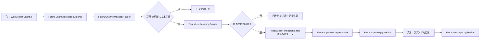

# 飞书 Agent 交互层 Channel SDK 模块设计

## 背景

`module-feishu` 已具备飞书配置管理、凭据层、消息发送、HTTP 事件回调和插件注册能力。当前需要新增 Agent 交互层，使用飞书官方 Java Channel SDK 通过 WebSocket 长连接接收消息事件，让本地调试不再依赖公网回调域名。

本设计采用方案 A：按“当前启用的飞书应用”做单活连接。系统启动后只读取当前启用的 `ps_feishu_config.enabled = 1` 配置，创建一个 Channel WebSocket 连接；后续若需要多租户多应用同时在线，再把连接管理器从单实例扩展为连接池。

## 设计目标

- 集成飞书官方 Java SDK 中的 `com.lark.oapi.ws.Client`，封装全局单例初始化和生命周期管理。
- 使用 WebSocket 长连接接收 `im.message.receive_v1` 事件，支持本地调试无需公网域名。
- 解析 @机器人消息，提取发送人 UserId、OpenId、群 ID、消息 ID、租户 Key 和指令文本。
- 支持三类回复能力：普通文本、流式分段打字机输出、带按钮交互式卡片。
- 建立飞书 UserId 与内部系统账号的映射工具，并在消息处理线程中注入内部权限上下文。
- 消息全链路日志落库，记录接收、解析、权限映射、回复和异常信息。
- 保持 Spring Boot Starter 风格，所有能力通过自动装配和 `feishu.agent.channel.*` 配置启停。

## 非目标

- 本阶段不实现多飞书应用同时长连接。
- 本阶段不开发完整前端管理页面。
- 本阶段不实现真实大模型推理，只提供可替换的 Agent 消息处理接口和默认回声处理器。
- 本阶段不替换已有 HTTP 事件回调入口；Channel 入口独立新增，HTTP 回调继续保留。

## 模块结构

```text
modules/module-feishu/
  module-feishu-core/
    src/main/java/com/xingju/module/feishu/
      channel/
        FeishuChannelClientManager.java
        FeishuChannelMessageListener.java
        FeishuChannelMessageParser.java
        FeishuAgentCommandMessage.java
        FeishuAgentMessageHandler.java
        NoopFeishuAgentMessageHandler.java
      reply/
        FeishuAgentReplyService.java
        FeishuAgentReplyClient.java
        FeishuCardTemplateFactory.java
        FeishuCardButton.java
        FeishuStreamReplyOptions.java
      mapping/
        FeishuUserMappingEntity.java
        FeishuUserMappingMapper.java
        FeishuUserMappingService.java
        FeishuUserPermissionBinder.java
        FeishuInternalUserSnapshot.java
      log/
        FeishuMessageLogEntity.java
        FeishuMessageLogMapper.java
        FeishuMessageLogService.java
        FeishuMessageLogStage.java

  module-feishu-autoconfig/
    src/main/java/com/xingju/module/feishu/autoconfig/
      FeishuAgentChannelProperties.java
      OfficialFeishuChannelClientManager.java
      OfficialFeishuAgentReplyClient.java
```

## 核心组件

### FeishuChannelClientManager

`FeishuChannelClientManager` 负责 Channel WebSocket 的全局单例管理。

职责：
- 启动时读取当前启用的飞书应用配置。
- 使用 `com.lark.oapi.ws.Client.Builder(appId, appSecret)` 创建 WebSocket Client。
- 注入 `EventDispatcher`，监听 `onP2MessageReceiveV1`。
- 支持自动重连，记录连接异常、重连开始、重连成功。
- 应用关闭时主动关闭连接。
- 当不存在启用配置时，不阻断主应用启动，只记录告警日志。

### FeishuChannelMessageListener

`FeishuChannelMessageListener` 是 `im.message.receive_v1` 的事件入口。

处理流程：
- 接收官方 SDK 的 `P2MessageReceiveV1`。
- 调用 `FeishuChannelMessageParser` 转换成内部命令消息。
- 判断是否为 @机器人消息；非 @机器人消息直接记录并忽略。
- 写入“已接收/已解析”日志。
- 调用 `FeishuUserPermissionBinder` 注入内部权限上下文。
- 调用 `FeishuAgentMessageHandler` 处理指令。
- 处理完成后清理权限上下文。
- 捕获解析、权限映射、回复发送、SDK 调用异常并落库。

### FeishuChannelMessageParser

`FeishuChannelMessageParser` 负责把 SDK 事件模型转换为稳定的内部模型 `FeishuAgentCommandMessage`。

提取字段：
- `messageId`
- `chatId`
- `chatType`
- `tenantKey`
- `senderUserId`
- `senderOpenId`
- `senderUnionId`
- `rawText`
- `commandText`
- `messageType`

指令文本规则：
- 只处理 `text` 类型消息。
- 从 `message.content` 的 JSON 中读取 `text`。
- 去除 @机器人文本片段和前后空白。
- 空指令返回默认提示，不进入业务 Agent 处理。

### FeishuAgentReplyService

`FeishuAgentReplyService` 面向业务层提供三种回复能力。

能力：
- `replyText(messageId, text)`：回复普通文本。
- `streamText(messageId, text, options)`：先发送首段文本，再按配置间隔追加或更新内容，形成打字机效果。
- `replyCard(messageId, card)`：回复交互式卡片。

底层通过 `FeishuAgentReplyClient` 调用官方 IM 消息接口。普通文本和卡片使用 `reply` 或 `create` 消息接口；流式输出优先使用发送后更新消息内容的方式实现。若飞书租户权限不支持更新消息，则降级为多条分段文本回复。

### FeishuCardTemplateFactory

`FeishuCardTemplateFactory` 负责封装带按钮的交互式卡片模板，避免业务层直接拼复杂 JSON。

默认模板：
- 标题。
- Markdown 正文。
- 按钮列表。
- 按钮支持 `primary`、`default`、`danger` 等类型。
- 按钮支持 URL 跳转和 `value` 交互值。

实现优先使用 SDK 的 `com.lark.oapi.card.model.MessageCard`、`MessageCardHeader`、`MessageCardAction`、`MessageCardEmbedButton` 等模型生成卡片内容。

### FeishuUserMappingService

`FeishuUserMappingService` 负责飞书用户和内部用户关系。

默认落库表：`ps_feishu_user_mapping`。

字段建议：
- `id`
- `feishu_user_id`
- `feishu_open_id`
- `feishu_union_id`
- `tenant_key`
- `internal_user_id`
- `internal_account`
- `internal_user_name`
- `organization_id`
- `organization_name`
- `data_scope`
- `permissions`
- `enabled`
- `remark`
- `deleted`
- `create_time`
- `update_time`

映射规则：
- 优先用 `tenant_key + feishu_user_id` 查找。
- 查不到时可回退到 `open_id` 或 `union_id`。
- 映射不存在或禁用时，拒绝执行需要内部权限的指令，并回复绑定提示。

### FeishuUserPermissionBinder

`FeishuUserPermissionBinder` 负责把映射结果转换为 `module-sys` 的 `UserPermissionContext`，并绑定到当前消息处理线程。

规则：
- 消息进入业务处理前绑定。
- 处理完成后无论成功失败都清理。
- 权限集合来自映射表中的 `permissions` 字段，后续可替换为从 `module-sys` 实时查询。
- 数据权限范围使用映射表中的 `data_scope`，默认 `SELF`。

### FeishuMessageLogService

`FeishuMessageLogService` 负责全链路日志落库。

默认落库表：`ps_feishu_message_log`。

字段建议：
- `id`
- `message_id`
- `chat_id`
- `tenant_key`
- `sender_user_id`
- `sender_open_id`
- `internal_user_id`
- `internal_account`
- `command_text`
- `reply_type`
- `stage`
- `success`
- `error_code`
- `error_message`
- `cost_millis`
- `raw_payload`
- `reply_payload`
- `create_time`

阶段枚举 `FeishuMessageLogStage`：
- `RECEIVED`
- `PARSED`
- `MAPPED`
- `HANDLED`
- `REPLIED`
- `FAILED`

## 自动装配设计

新增配置类 `FeishuAgentChannelProperties`：

```yaml
feishu:
  agent:
    channel:
      enabled: true
      auto-start: true
      auto-reconnect: true
      await-ready-timeout-seconds: 10
      stream:
        chunk-size: 80
        interval-millis: 300
      log:
        enabled: true
        record-raw-payload: true
        record-reply-payload: true
```

自动装配规则：
- `feishu.enabled=true` 且 `feishu.agent.channel.enabled=true` 时装配。
- 存在 `FeishuConfigService` 时启用运行时飞书配置读取。
- 存在 MyBatis 环境时注册飞书映射和消息日志 Mapper。
- 默认注册 `NoopFeishuAgentMessageHandler`，业务模块可提供同名接口 Bean 覆盖。
- 默认注册数据库初始化器，表不存在才创建，字段缺失才补齐。

## 数据流



## 错误处理

- SDK 连接异常：记录连接阶段日志，允许自动重连。
- 启用配置不存在：主应用继续启动，Channel 模块不建立连接并记录告警。
- 消息解析失败：记录 `FAILED`，不触发业务处理。
- 用户映射失败：回复绑定提示，记录 `FAILED`。
- 权限上下文注入失败：记录 `FAILED`，不触发业务处理。
- 回复发送失败：记录飞书 SDK 返回码和错误消息。
- 流式回复中途失败：记录失败分段和已发送内容。

## 测试策略

- Parser 单元测试：验证 `P2MessageReceiveV1` 到内部命令消息的字段提取、@机器人判断和指令文本清洗。
- Reply Service 单元测试：验证文本、流式分段、卡片回复调用参数。
- Card Template 单元测试：验证按钮顺序、按钮类型、URL/value 字段。
- Mapping Service 单元测试：验证 UserId/OpenId/UnionId 映射优先级和禁用状态。
- Permission Binder 单元测试：验证权限上下文绑定和清理。
- Log Service 单元测试：验证各阶段日志保存。
- AutoConfiguration 测试：验证开关启停、默认 Bean、可替换 Bean、无启用配置不阻断启动。
- 编译验证：至少运行 `mvn -pl modules/module-feishu/module-feishu-core test` 和 `mvn -pl modules/module-feishu/module-feishu-autoconfig -am test`。

## 实施边界

实施时先写测试，再实现代码。第一阶段交付 SDK 初始化工具、消息监听器、消息回复工具类、卡片模板封装类、用户映射工具、日志落库服务和自动装配；后续业务 Agent 只需要实现 `FeishuAgentMessageHandler` 即可接入真实指令处理。
