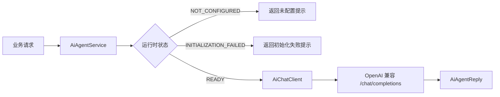

# AI Agent Spring Boot Starter 说明文档

`ai-agent-spring-boot-starter` 是 Production Studio 的轻量 AI 智能体 starter。它以 Spring Boot 自动装配方式提供 AI 聊天、技能注册、MCP 工具接口、A2A 接口和外部通道接入能力，可被业务插件模块复用。

该模块当前定位为“简易 OpenClaw 风格智能体核心”：业务模块只需要贡献 `AiSkill` Bean 或接入 `AiChannelHandler`，即可把自身能力开放给 AI 调度、MCP 调用或飞书等外部通道。

## 模块职责

- 统一管理 AI 智能体基础配置，配置前缀为 `ai.agent`。
- 基于 AgentScope Harness 初始化智能体运行时状态。
- 封装 OpenAI 兼容格式的大模型调用客户端。
- 自动注册默认 AI 技能，并收集业务模块贡献的 `AiSkill` Bean。
- 对外提供 MCP JSON-RPC 工具接口。
- 对外提供 A2A agent-card 与消息接口。
- 提供 `AiChannelHandler`，承接飞书、企业微信、WebSocket 等外部通道消息。

## 工程结构

```text
modules/ai-agent-spring-boot-starter
├── pom.xml
├── src/main/java/com/xingju/starter/ai
│   ├── AiAgentProperties.java          # ai.agent 配置属性
│   ├── AiAgentService.java             # AI 对话服务门面
│   ├── AiAgentReply.java               # AI 回复模型
│   ├── autoconfig/
│   │   └── AiAgentAutoConfiguration.java
│   ├── chat/
│   │   ├── AiChatClient.java
│   │   ├── AiChatRequest.java
│   │   ├── AiChatResponse.java
│   │   └── OpenAiCompatibleChatClient.java
│   ├── runtime/
│   │   ├── AiAgentRuntime.java
│   │   ├── AiAgentRuntimeFactory.java
│   │   └── AiAgentRuntimeStatus.java
│   ├── skill/
│   │   ├── AiSkill.java
│   │   ├── AiSkillRegistry.java
│   │   ├── AiSkillResult.java
│   │   ├── AiSkillDescriptor.java
│   │   └── DefaultAiSkills.java
│   ├── mcp/
│   │   ├── McpController.java
│   │   ├── McpJsonRpcRequest.java
│   │   └── McpJsonRpcResponse.java
│   ├── a2a/
│   │   ├── A2aController.java
│   │   ├── A2aAgentCard.java
│   │   └── A2aMessageRequest.java
│   └── channel/
│       ├── AiChannelMessage.java
│       ├── AiChannelReply.java
│       └── AiChannelHandler.java
└── src/main/resources
    ├── application.yaml
    └── META-INF/spring/org.springframework.boot.autoconfigure.AutoConfiguration.imports
```

## 自动装配

自动装配入口为：

```text
com.zimo.starter.ai.autoconfig.AiAgentAutoConfiguration
```

装配条件：

- `ai.agent.enabled=true` 时启用。
- `ai.agent.enabled` 未配置时默认启用。
- 所有核心 Bean 均使用 `@ConditionalOnMissingBean` 或指定 Bean 名称避让业务自定义实现。

默认装配 Bean：

| Bean | 作用 |
| --- | --- |
| `echoAiSkill` | 连通性检查技能 |
| `summarizeAiSkill` | 文本摘要技能 |
| `generatePlanAiSkill` | 计划生成技能 |
| `routePluginTaskAiSkill` | 插件任务路由技能 |
| `AiSkillRegistry` | 汇总所有 `AiSkill` Bean |
| `AiAgentRuntimeFactory` | 创建 AgentScope 运行时描述 |
| `AiAgentRuntime` | 当前智能体运行状态 |
| `AiChatClient` | OpenAI 兼容大模型客户端 |
| `AiAgentService` | AI 聊天服务门面 |
| `AiChannelHandler` | 外部通道消息处理器 |
| `McpController` | MCP JSON-RPC 接口 |
| `A2aController` | A2A 接口 |

## 配置项

配置前缀：`ai.agent`

```yaml
ai:
  agent:
    enabled: true
    name: ${AI_AGENT_NAME:ai-agent}
    model-name: ${LLM_MODEL_NAME:qwen-plus}
    model-type: ${LLM_MODEL_TYPE:dashscope_chat}
    base-url: ${LLM_BASE_URL:https://dashscope.aliyuncs.com/compatible-mode/v1}
    api-key: ${DASHSCOPE_API_KEY:}
    temperature: ${LLM_TEMPERATURE:0.7}
    max-tokens: ${LLM_MAX_TOKENS:2000}
    max-iters: ${AGENT_MAX_ITERS:5}
    chat-history-limit: ${CHAT_HISTORY_LIMIT:20}
```

| 配置项 | 默认值 | 说明 |
| --- | --- | --- |
| `enabled` | `true` | 是否启用 AI starter |
| `name` | `ai-agent` | 智能体名称 |
| `model-name` | `qwen-plus` | 模型名称 |
| `model-type` | `dashscope_chat` | 模型接口类型；默认及其他值按 OpenAI 兼容协议，`dashscope_native` 使用原生 DashScope 协议 |
| `base-url` | `https://dashscope.aliyuncs.com/compatible-mode/v1` | OpenAI 兼容接口地址 |

> 使用 `dashscope_native` 时，`base-url` 应配置为原生 DashScope 根地址（例如 `https://dashscope.aliyuncs.com`），不能使用 `/compatible-mode/v1`。
| `api-key` | 空 | 大模型 API Key，建议通过环境变量注入 |
| `temperature` | `0.7` | 采样温度 |
| `max-tokens` | `2000` | 单次回复最大 token 数 |
| `max-iters` | `5` | 预留智能体最大迭代次数 |
| `chat-history-limit` | `20` | 预留会话历史上限 |

当 `api-key` 为空时，模块不会让应用启动失败，而是把运行时状态置为 `NOT_CONFIGURED`，对话接口会返回“AI 服务未配置”的提示。

## 运行时状态

`AiAgentRuntimeFactory` 会根据配置和 AgentScope Harness 依赖创建运行时描述：

| 状态 | 含义 |
| --- | --- |
| `READY` | AgentScope Harness 初始化成功 |
| `NOT_CONFIGURED` | 未配置 `ai.agent.api-key` |
| `INITIALIZATION_FAILED` | AgentScope Harness 缺失或初始化异常 |

运行时描述包含智能体名称、模型名称、模型类型、技能描述列表、状态和状态消息。

## 聊天调用链路



`OpenAiCompatibleChatClient` 调用路径为：

```text
POST {ai.agent.base-url}/chat/completions
```

请求体使用 OpenAI 兼容格式：

```json
{
  "model": "qwen-plus",
  "messages": [
    {
      "role": "user",
      "content": "用户消息"
    }
  ],
  "temperature": 0.7,
  "max_tokens": 2000
}
```

客户端会从响应的 `choices[0].message.content` 提取回复内容。异常信息中会对 API Key 做脱敏处理。

## 技能体系

技能接口：

```java
public interface AiSkill {
    String name();

    String description();

    boolean readOnly();

    AiSkillResult call(Map<String, Object> arguments);
}
```

业务模块只要声明 `AiSkill` Bean，就会被 `AiSkillRegistry` 自动收集。例如：

```java
@Bean
public AiSkill demoSkill() {
    return new AiSkill() {
        @Override
        public String name() {
            return "demo_skill";
        }

        @Override
        public String description() {
            return "示例技能";
        }

        @Override
        public boolean readOnly() {
            return true;
        }

        @Override
        public AiSkillResult call(Map<String, Object> arguments) {
            return AiSkillResult.ok("收到参数：" + arguments);
        }
    };
}
```

默认技能：

| 技能名 | 说明 | 只读 |
| --- | --- | --- |
| `echo` | 回显输入参数，便于连通性测试 | 是 |
| `summarize` | 返回文本摘要入口，目前为轻量实现 | 是 |
| `generate_plan` | 生成计划入口，目前为轻量实现 | 是 |
| `route_plugin_task` | 插件任务路由入口，目前为轻量实现 | 是 |

## MCP 接口

接口地址：

```text
POST /api/ai/mcp
```

支持方法：

| 方法 | 说明 |
| --- | --- |
| `tools/list` | 返回所有已注册技能描述 |
| `tools/call` | 调用指定技能 |

列出工具示例：

```json
{
  "jsonrpc": "2.0",
  "id": "1",
  "method": "tools/list"
}
```

调用工具示例：

```json
{
  "jsonrpc": "2.0",
  "id": "2",
  "method": "tools/call",
  "params": {
    "name": "echo",
    "arguments": {
      "text": "hello"
    }
  }
}
```

未知方法会返回 JSON-RPC 错误：

```json
{
  "jsonrpc": "2.0",
  "id": "1",
  "result": null,
  "error": {
    "code": -32601,
    "message": "Unknown MCP method: xxx"
  }
}
```

## A2A 接口

Agent Card：

```text
GET /api/ai/a2a/agent-card
```

响应包含：

- `name`：智能体名称。
- `description`：智能体描述。
- `capabilities`：能力列表，目前包含 `mcp-tools`、`skill-routing`、`plugin-assistant`。

消息接口：

```text
POST /api/ai/a2a/message
```

请求示例：

```json
{
  "message": "你好"
}
```

响应模型：

```json
{
  "agent": "ai-agent",
  "content": "回复内容"
}
```

## 外部通道接入

外部通道使用 `AiChannelHandler` 统一接入，适用于飞书机器人、企业微信机器人、WebSocket 会话等场景。

通道消息模型：

```java
AiChannelMessage.of(
        "feishu",
        tenantId,
        userId,
        conversationId,
        messageId,
        text);
```

`AiChannelMessage#sessionId()` 会按以下顺序拼接非空字段：

```text
channel:tenantId:conversationId:userId
```

普通消息会进入 `AiAgentService.chat(text, sessionId)`。

技能命令以 `技能 ` 开头：

```text
技能 echo text=你好 source=飞书
```

支持带空格的引号参数：

```text
技能 echo text="你好 世界" source=飞书
```

支持 JSON 参数体：

```text
技能 echo {"text":"你好 世界","source":"飞书"}
```

技能调用异常会被兜底为文本回复：

```text
技能调用失败：错误信息
```

当前飞书模块已通过 `FeishuAiChannelMessageHandler` 接入该通道，并由 `feishu.agent.ai-channel.enabled=true` 显式启用。

## 与业务插件集成

推荐集成方式：

1. 业务模块依赖 `ai-agent-spring-boot-starter`。
2. 业务模块声明一个或多个 `AiSkill` Bean。
3. 如果业务模块有外部消息入口，调用 `AiChannelHandler#handle`。
4. 如果需要替换大模型调用方式，实现自定义 `AiChatClient` Bean。
5. 如果需要替换运行时初始化方式，实现自定义 `AiAgentRuntime` 或 `AiAgentRuntimeFactory` Bean。

自动装配避让规则：

- 自定义 `AiChatClient` 后，默认 `OpenAiCompatibleChatClient` 不再创建。
- 自定义 `AiSkillRegistry` 后，默认注册表不再创建。
- 自定义 `AiChannelHandler` 后，默认通道处理器不再创建。
- 默认技能按 Bean 名称避让，可以单独替换其中某个技能。

## 测试覆盖

当前测试覆盖：

| 测试类 | 覆盖内容 |
| --- | --- |
| `AiAgentAutoConfigurationTest` | 自动装配、默认技能、自定义 `AiChatClient` 避让 |
| `AiAgentServiceTest` | 未配置、空消息、成功回复、模型错误 |
| `AiChannelHandlerTest` | 普通消息、技能命令、引号参数、JSON 参数、异常兜底 |
| `OpenAiCompatibleChatClientTest` | OpenAI 兼容响应解析、错误处理、API Key 脱敏 |
| `AiAgentRuntimeFactoryTest` | 运行时状态与 AgentScope 初始化失败处理 |
| `AiSkillRegistryTest` | 技能列表、未知技能调用 |
| `McpControllerTest` | `tools/list` 和 `tools/call` |
| `A2aControllerTest` | agent-card 和 message 接口 |

## 验证命令

模块级测试：

```bash
mvn -pl modules/ai-agent-spring-boot-starter test
```

被其他模块联动验证时，可以运行依赖该 starter 的模块，例如：

```bash
mvn -pl modules/module-feishu/module-feishu-autoconfig -am test
```

## 注意事项

- 不要把真实 API Key 写入仓库文件、文档或日志，建议通过环境变量注入。
- 当前聊天客户端只发送单轮 user message，`chat-history-limit` 暂为预留配置。
- 当前默认技能是轻量占位实现，真实业务能力应由业务插件贡献 `AiSkill` Bean。
- 外部通道技能命令适合明确工具调用；复杂自然语言意图识别后续可在 `AiAgentService` 或业务调度层增强。
"# agent-spring-boot-starter" 
